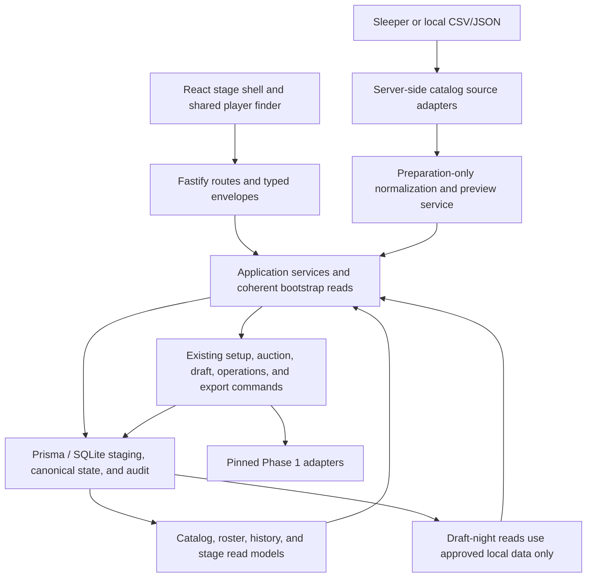
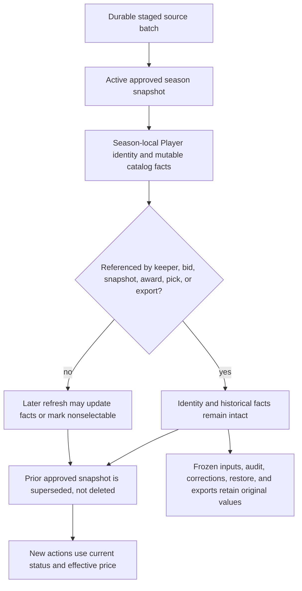
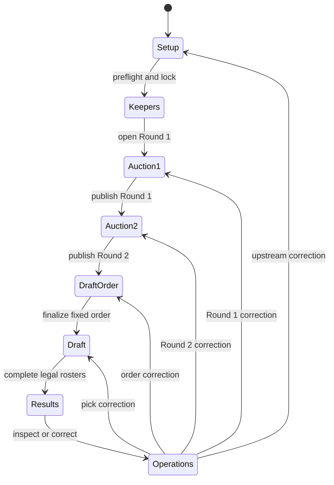
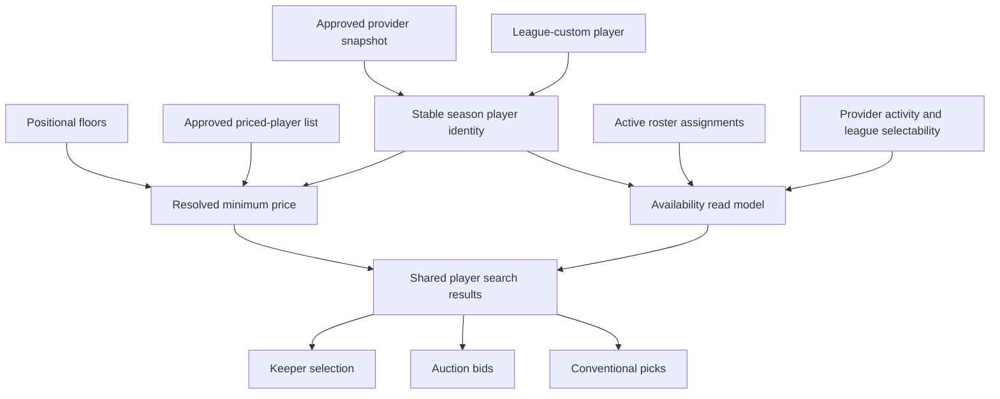
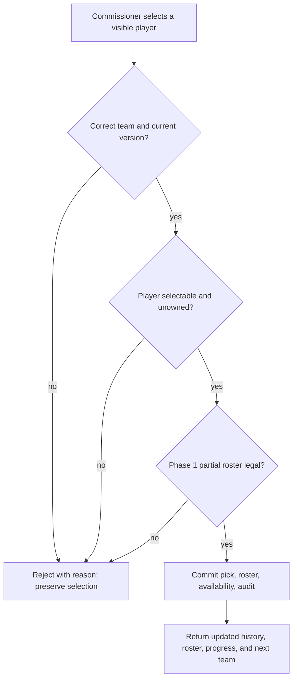
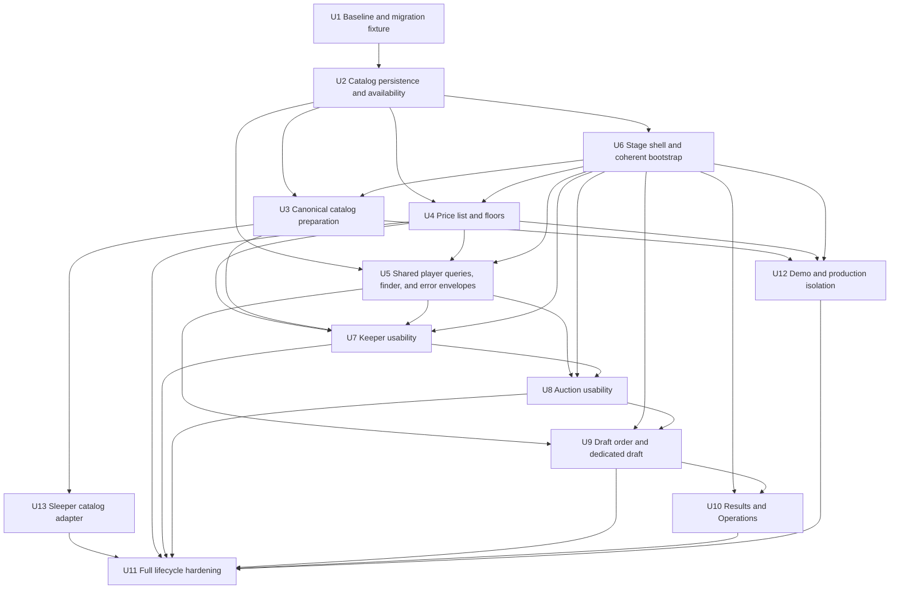

# Phase 2.5 Draft-Night Usability - Plan

## Goal Capsule

- **Objective:** Make the accepted local Commissioner application comfortable for one commissioner to prepare and run the league's complete real draft this season.
- **Authority:** The confirmed Phase 2.5 Product Contract in this plan governs usability behavior. Commit `23c994c` and `outputs/phase-2-implementation-plan.md` define the accepted Phase 2 application baseline. Root `src/` and `test/` remain the Phase 1 auction and roster authority.
- **Execution profile:** Deep, persistence-bearing usability expansion across catalog ingestion, pricing, read models, navigation, keeper entry, auction entry, conventional drafting, Results, and Operations.
- **Baseline prerequisite:** Before Phase 2.5 changes begin, create and publish an annotated `phase2-baseline` tag at `23c994c`, verify the worktree is clean, and branch Phase 2.5 from that exact commit. The tag does not currently exist.
- **Stop conditions:** Stop if implementation requires a Phase 1 allocation or roster-rule change, weakens a Phase 2 transaction/audit/recovery guarantee, cannot migrate a released Phase 2 database without preserving history, or discovers that the selected catalog use is not permitted for this non-commercial application.
- **Tail ownership:** This plan is review-gated. It does not authorize implementation until the user explicitly starts Phase 2.5 work.

---

## Product Contract

### Summary

Phase 2.5 turns the working Phase 2 console into a draft-night application for one commissioner. It adds a maintainable NFL catalog, league pricing preparation, searchable player selection, stage-specific keeper and auction workflows, a dedicated conventional draft screen, Results, and a separate Operations area.

The application remains local, offline during the draft, restart-safe, audited, and compatible with every accepted Phase 1 and Phase 2 behavior. Multi-user operation remains Phase 3 work.

### Problem Frame

The Phase 2 workflow is functionally complete but exposes test scaffolding as the product. The built-in catalog is too small, core actions require database-oriented player IDs, all lifecycle controls share one page, and the conventional draft lacks the information density needed to make repeated picks quickly and confidently.

A usability-only rewrite would be unsafe because player identity, price resolution, ownership, availability, lifecycle state, corrections, backups, and audit history are connected. Phase 2.5 must improve those surfaces through the existing application-service and repository boundaries rather than recreating business rules in React.

### Key Decisions

- **Keep Phase 2 as a tagged stable baseline** `(session-settled: user-directed — chosen over continuing to mutate the accepted feature branch: Phase 2 is accepted and must remain recoverable)`. Governs R1–R3.
- **Optimize for one commissioner running this season's complete draft** `(session-settled: user-directed — chosen over beginning multi-user Phase 3: draft-night practicality is the immediate need)`. Governs R4–R35.
- **Use the league price list as player-level minimum-price overrides** `(session-settled: user-approved — chosen over automated fantasy valuation: listed prices override positional floors and unlisted players use their floor)`. Governs R11–R14.
- **Fetch player data only during preparation and draft from an approved local snapshot** `(session-settled: user-approved — chosen over live player lookups: draft-night operation must not depend on the network)`. Governs R4–R7, R33.
  External-provider fetching occurs only during preparation; every draft-time player read comes from the approved local snapshot.
- **Treat custom players as first-class catalog players** `(session-settled: user-approved — chosen over special-case buttons and IDs: Eddie Gallagher and future custom players need the same search, pricing, availability, and roster behavior)`. Governs R8, R9, R13, R15–R27.
- **Guide normal work through lifecycle stages and move exceptional work to Operations** `(session-settled: user-approved — chosen over the single all-actions console: normal draft flow should be obvious while corrections remain deliberate)`. Governs R19–R21, R28–R31.
- **Exclude multi-user, automated valuation, and ESPN integration** `(session-settled: user-directed — chosen over broadening Phase 2.5: none is necessary for single-commissioner usability)`. Governs R35.

### Actors

- A1. **Commissioner:** Prepares the catalog and pricing, selects keepers, enters bids, records external decisions, runs the conventional draft, reviews results, and invokes Operations when needed.
- A2. **Commissioner application:** Normalizes imported data, validates commands, persists canonical state and audit history, derives read models, and restores the correct stage after restart or correction.
- A3. **Catalog source:** Sleeper by default, or a commissioner-supplied CSV/JSON snapshot, provides preparation-time player facts but has no authority over draft ownership or Phase 1 rules.

### Requirements

**Baseline and compatibility**

- R1. The exact accepted Phase 2 commit `23c994c` is protected by the annotated `phase2-baseline` tag before Phase 2.5 changes begin.
- R2. Phase 2.5 preserves all Phase 1 allocation and roster semantics and all Phase 2 lifecycle, idempotency, concurrency, persistence, audit, backup, restore, correction, and export behavior.
- R3. Every Phase 2 database and backup remains readable after an additive, copy-safe migration that preserves player IDs, snapshots, audit lineage, correction lineage, and historical results.

**NFL catalog and annual preparation**

- R4. The commissioner can populate a season with a current, fantasy-relevant NFL catalog from Sleeper or from a local canonical CSV/JSON file.
- R5. Each normalized NFL player carries a stable source identity, display name, NFL team or free-agent state, supported fantasy position, provider status, source provenance, and source update time.
- R6. A catalog refresh stores immutable normalized rows and review dispositions in SQLite, binds them to source hash, normalized hash, schema version, season version, and expiry, and requires explicit approval before promotion.
- R7. Catalog refresh is available only during `SETUP`; one approved snapshot per source namespace is active, prior snapshots are superseded rather than deleted, and an omitted, renamed, or changed row never deletes or rekeys a referenced player. Refreshing an existing season from a manual file requires the existing source namespace and aliases or an explicit cross-source identity disposition; names never merge identities automatically.
- R8. During `SETUP`, the commissioner can create and edit unreferenced league-custom players, including Eddie Gallagher at K, without an external NFL identity; annual NFL refreshes never supersede or deactivate them. Once a custom player is referenced or keepers are locked, changing identity facts requires an audited correction that retains the old facts for history and creates a new selectable revision.
- R9. Every player-selection surface supports normalized name search and filters for NFL team, position, source, and availability without requiring a raw player ID.
- R10. During `SETUP`, the commissioner can review or change league selectability independently of provider status; every result then shows provider activity, selectability, ownership, and the highest-priority reason it cannot be selected.

**Minimum prices, price list, and keepers**

- R11. The commissioner can review and edit positive whole-dollar positional floors for QB, RB, WR, TE, K, and DST, with unresolved or invalid pricing visible before keeper lock.
- R12. The commissioner can stage a league priced-player-list CSV/JSON import, reconcile rows by stable source identity or explicit human-approved match, and review duplicates, unmatched rows, ambiguous names, team/position conflicts, additions, changes, and removals before commit.
- R13. The commissioner can add, edit, or clear a provenance-bearing manual player price from the UI, including for league-custom players; a manual price takes precedence over list assignments until explicitly cleared.
- R14. With no manual price, the active approved list assignment is the player's auction `minimumBid`; without either override the positional floor applies, and keeper lock rejects any selectable player without a resolved positive minimum.
- R15. The Keepers stage presents one team at a time with searchable eligible players, the $50 keeper cost, the resulting $300 or $350 Round 1 budget, current selections for every team, and an explicit lock review.

**Auction usability**

- R16. Auction 1 and Auction 2 use searchable player selection for every bid while displaying player position, NFL team, availability, minimum bid, and the active team's remaining budget.
- R17. Each auction team has a commissioner-friendly zero-to-three row priority editor with reordering, amount validation, explicit Save draft, explicit zero-bid confirmation, finalization status, and privacy masking when the commissioner leaves that team. Saved drafts persist through restart; dirty drafts must be saved or discarded before team/stage navigation.
- R18. Auction lock, resolution, external tie decisions, reveal, review, publication, Round 2 budget derivation, and frozen input/output records continue through the accepted Phase 2 services and Phase 1 adapter without semantic change.

**Stage navigation and shared interaction**

- R19. The normal application presents resume-aware navigation in this order: Setup → Keepers → Auction 1 → Auction 2 → Draft Order → Draft → Results.
- R20. The current legal stage exposes primary mutations; completed stages remain inspectable and an attempted upstream edit routes to an audited correction preview instead of changing history directly.
- R21. Team, player, tie, pick, correction, and other domain-object selection uses names and contextual labels; internal IDs may appear only as secondary diagnostic detail in Operations.

**Dedicated conventional draft**

- R22. The Draft stage is a dedicated screen with a persistent, prominent current-team/on-the-clock banner, overall pick, round, fixed order, and progress toward completion. At 1366×768 the banner and pick action remain fixed while the available-player, current-roster, other-roster, and history regions scroll or collapse independently.
- R23. The commissioner selects from a paged available-player list with name, NFL team, position, source, minimum price, availability reason, and the same filters defined by R9.
- R24. The Draft stage shows the current team's canonical roster grouped by position, remaining roster capacity and legal positional needs, and a selectable view of every other team's roster.
- R25. The Draft stage shows active draft history in reverse chronological order and retains superseded history in the audited Operations view.
- R26. A successful legal pick commits once, updates availability, roster, history, progress, and the on-the-clock team from the returned server state, then clears only the completed selection.
- R27. An illegal pick changes no canonical state and explains the specific clock, ownership, availability, unknown-position, capacity, or roster-rule rejection beside the retained player selection and filters.

**Results, Operations, demo separation, and resilience**

- R28. Results is the default completed-season stage and shows final team rosters, acquisition source, costs, pick numbers, completed draft history, backup status, and deterministic export actions.
- R29. Backup, recovery summary, audit browsing, correction target selection, correction preview/confirmation, and stopped-server restore guidance live in a separate Operations area, with only contextual recovery alerts in the normal stage flow.
- R30. Hardcoded two-team setup, sample players, $1 floors, fixed tie choices, and other fixtures are available only through an explicit demo/test startup profile; the packaged production UI exposes neutral commissioner forms and does not register demo mutation routes.
- R31. Loading or resuming a season hydrates setup, current auction, draft order, draft, and version state atomically; failure leaves the previously active season and expected version fully usable.
- R32. Every Phase 2.5 mutation uses the existing actor, idempotency key, expected season version, serialized transaction, paired append-only audit event, and checkpoint policy where applicable.
- R33. Draft-night startup, search, selection, bidding, picking, correction, backup, recovery, Results, and export use only local approved data and make no catalog-provider request.
- R34. Restart, correction, backup, restore, and export continue to derive their resume state from canonical persisted records rather than browser memory or mutable provider data.
- R35. Phase 2.5 does not add owner accounts, remote bidding, realtime clients, hosted deployment, automated valuations/rankings, projection feeds, or ESPN integration.

### Key Flows

- F1. **Prepare the annual NFL catalog**
  - **Trigger:** A1 prepares a new season while it is in `SETUP`.
  - **Steps:** Choose source → fetch or select local file → normalize → validate/hash → preview differences and identity reviews → approve → promote the normalized season catalog.
  - **Outcome:** A versioned local catalog is ready for offline setup and draft-night search.
  - **Covered by:** R4–R10, R32–R33.
- F2. **Prepare league pricing**
  - **Trigger:** A1 has an approved season catalog.
  - **Steps:** Set positional floors → import the priced-player list → reconcile ambiguous/unmatched rows → edit exceptions → review resolved prices.
  - **Outcome:** Every selectable player has one explainable minimum price.
  - **Covered by:** R11–R14.
- F3. **Select and lock keepers**
  - **Trigger:** Catalog, teams, eligibility, and pricing pass preflight.
  - **Steps:** Visit each team → search eligible players → select zero or one keeper → review costs and budgets → lock keepers.
  - **Outcome:** Canonical keeper assignments and Round 1 budgets are frozen.
  - **Covered by:** R15, R19–R21, R32.
- F4. **Run both auction rounds**
  - **Trigger:** A1 enters Auction 1 or Auction 2 from its legal predecessor.
  - **Steps:** Select active team → enter/reorder zero-to-three bids → finalize/mask → lock → resolve ties → reveal/review → publish.
  - **Outcome:** Accepted Phase 2 auction awards and balances advance the season.
  - **Covered by:** R16–R18, R32.
- F5. **Finalize draft order and run the conventional draft**
  - **Trigger:** Round 2 is published.
  - **Steps:** Calculate order → record external tie precedence → finalize → search available players → inspect roster needs → commit legal pick → auto-advance → repeat.
  - **Outcome:** Every team has a complete legal roster and the season is `COMPLETED`.
  - **Covered by:** R19–R27, R32.
- F6. **Review results and export**
  - **Trigger:** The draft completes or A1 loads a completed season.
  - **Steps:** Review final rosters/history → verify backup status → create deterministic CSV/JSON exports.
  - **Outcome:** Human-readable final results and existing export artifacts agree.
  - **Covered by:** R28, R33–R34.
- F7. **Recover or correct**
  - **Trigger:** Startup reports recovery context or A1 identifies an incorrect domain action.
  - **Steps:** Enter Operations → choose a labeled target → preview impact → create required backup → confirm audited correction → rehydrate the restored legal stage.
  - **Outcome:** The commissioner resumes normal staged navigation with original history retained.
  - **Covered by:** R20, R21, R29, R31–R34.

### Acceptance Examples

- AE1. **Provider unavailable:** Given an approved local catalog, when Sleeper is unreachable during a refresh, then the refresh reports a retryable preparation error and leaves the approved catalog and season byte-for-byte unchanged. Covers R6, R33.
- AE2. **Referenced player omitted:** Given an existing keeper or historical roster references a player, when a later catalog snapshot omits that source ID, then the reference, name, audit history, and season result remain intact while the preview explains the source-status change. Covers R3, R7, R10.
- AE3. **Protected custom player:** Given Eddie Gallagher exists as a league-custom K, when a Sleeper refresh and priced-list import run, then Eddie remains searchable, can receive a manual/list price, and is never matched or deactivated by an NFL source row. Covers R8, R13.
- AE4. **Price resolution:** Given a WR floor of $3, a listed WR at $12, and an unlisted WR, when pricing is reviewed, then their minimum bids are $12 and $3 with visible source labels. Covers R11–R14.
- AE5. **Ambiguous price-list row:** Given two players normalize to the same name and the list row lacks a stable ID, when preview runs, then no price is applied until A1 selects the intended player or excludes the row. Covers R12.
- AE6. **Search parity:** Given one owned RB, one selectable RB, one provider-inactive RB, and one custom RB, when A1 uses Keeper, Auction, and Draft search, then each surface returns the same status and availability reason for each player. Covers R9–R10, R16, R23.
- AE7. **Private auction entry:** Given Alpha has finalized bids, when A1 switches to Beta, then Alpha's players and amounts are masked while status and bid count remain visible. Covers R17.
- AE8. **Legal pick auto-advance:** Given Alpha is on the clock and selects a legal player, when the pick succeeds, then history and Alpha's roster update, the player becomes unavailable, and Beta becomes prominent without a page reload. Covers R22–R26.
- AE9. **Illegal pick explanation:** Given Alpha has no legal K capacity, when A1 selects another K, then no pick or audit mutation is created and the Draft screen retains the selection while explaining the positional capacity rejection. Covers R24, R27.
- AE10. **Restart in every stage:** Given the process stops after any acknowledged stage command, when it restarts, then it loads the same season/version and opens the correct current stage with no provider call. Covers R19, R31, R33–R34.
- AE11. **Correction resumes navigation:** Given five conventional picks exist, when A1 confirms correction of pick three, then Operations retains the superseded history and the app opens Draft with pick three's team on the clock. Covers R20, R25, R29, R34.
- AE12. **Production/demo isolation:** Given the packaged production server, when a user opens Setup or requests a demo mutation route, then no sample actions appear and the route is unavailable; the explicit demo profile remains capable of seeding deterministic E2E data. Covers R30.
- AE13. **Dirty auction draft:** Given Alpha has unsaved bid edits, when A1 tries to switch teams or stages, then the UI requires Save draft or Discard; after Save draft and restart, Alpha's rows return masked until Alpha is reselected. Covers R17, R31, R34.

### Success Criteria

- A commissioner can prepare a realistic season and complete the full draft without reading or typing a player, team, pick, or correction database ID.
- The on-the-clock team, available-player selection, current roster, roster needs, and recent history are simultaneously usable on a 1366×768 desktop viewport.
- A representative full-catalog fixture remains searchable and filterable without loading the whole catalog into every stage response.
- The full browser lifecycle covers catalog preparation, pricing, keepers, both auctions, draft order, 28 or more conventional picks, Results, correction resume, restart, and export.
- All Phase 1 and accepted Phase 2 test suites remain green without weakening assertions or replacing canonical services with UI logic.
- A packaged production rehearsal completes with outbound network access disabled and contains no demo controls or demo mutation routes.

### Scope Boundaries

**Deferred to Phase 3 or later**

- Owner accounts, authentication, authorization, owner self-service, remote sealed bids, realtime updates, hosted deployment, and multi-browser collaboration.
- Automated player valuations, rankings, projections, injury/news feeds, ESPN integration, and imports from a specific fantasy host.
- Automated ingestion of historical league rosters for keeper eligibility; Phase 2.5 makes the existing eligibility and selection workflow usable but does not infer eligibility from an external league.
- Mobile owner-facing draft experiences and public spectator boards.

**Outside this phase's product behavior**

- Changing keeper cost, starting budgets, Round 2 budget calculation, sealed-bid limits, auction allocation, tie semantics, fixed draft order, roster rules, or 14-player completion.
- Requiring an internet connection during draft operation.
- Treating provider status, price-list rank, or a player name as canonical ownership identity.
- Bundling or redistributing a current provider catalog in the public repository or production package.

---

## Planning Contract

### Key Technical Decisions

- KTD1. **Freeze and characterize the accepted baseline first.** The Phase 2 tag and released schema-6 fixture are prerequisites, and root Phase 1 code/tests remain untouched. This instantiates R1–R3.
- KTD2. **Keep immutable season-local player identity as draft authority.** `Player.id` never changes after creation. Provider identities are immutable aliases with non-null source namespace and source ID uniqueness; refresh matches aliases and updates current catalog facts without replacing `Player.id`. One active approved snapshot per season/namespace supersedes earlier snapshots. A manual refresh of an existing namespace must carry those aliases; a different namespace enters an explicit cross-source reconciliation and cannot create a duplicate active projection silently. Custom players start with only an application identity, and adding any alias requires explicit identity review. Referenced identity/display facts remain frozen in their accepted command records; editing a referenced custom player supersedes its selectable revision rather than rewriting prior facts. This covers R3–R8.
- KTD3. **Use a provider-neutral source port with Sleeper as the default adapter.** Sleeper is read-only, tokenless, free for non-commercial use, fantasy-oriented, and explicitly asks clients to cache its bulk player map. Manual canonical CSV/JSON uses the same normalization pipeline. This covers R4–R6 and R33.
- KTD4. **Make ownership-derived eligibility canonical and keep `Player.available` as a checked compatibility projection.** Active non-superseded `RosterAssignment` rows determine ownership. Provider activity and league selectability determine eligibility for new actions. Existing commands continue to update `Player.available` transactionally, but a repository consistency assertion must prove it matches the derived model after migration, correction, restore, and before keeper lock. Blocking reasons use fixed precedence: owned, league-disabled, catalog-inactive, available; superseded acquisition history is informational and never blocks a player whose active ownership has been corrected away. This covers R7, R9–R10, R16, R23.
- KTD5. **Never use names as persistent identity.** NFL identity is an immutable source alias and custom identity is an application UUID. Normalized name/team/position can propose a price-list match but requires explicit confirmation when no stable ID is present. A provider alias collision with multiple players or multiple aliases proposed for one player blocks promotion until disposition. This covers R5, R7–R8, R12.
- KTD6. **Persist immutable preparation batches inside the database backup boundary.** Provider fetch or file read and pure normalization occur outside the write transaction. SQLite stores the normalized rows, validation results, collision dispositions, hashes, schema version, bound season version, and expiry. Approval revalidates those bindings, promotes the approved snapshot and player projection, writes audit metadata, and increments the season version in one transaction. Rejected/expired batches are retained as bounded metadata and their bulky rows are pruned only after they cannot be approved; superseded approved lineage remains. This covers R6–R7, R32–R34.
- KTD7. **Model manual and priced-list assignments as separate provenance-bearing history.** Each assignment records source type, batch/row or manual audit origin, value, active/superseded state, and effective precedence. Manual overrides win until cleared. A new list supersedes only assignments owned by the prior list, and omission never clears a manual value. Frozen auction inputs retain the resolved minimum used at lock. This covers R11–R14.
- KTD8. **Serve lifecycle-aware player and roster read models.** Add paged server queries for catalog search, availability, rosters, roster needs, history, and correction targets. React does not infer canonical availability, price resolution, ownership, or legal stage. This covers R9–R10, R15–R29.
- KTD9. **Use one reusable player finder contract.** Keeper, auction, draft, pricing, and correction selectors share query parameters, result labels, keyboard selection, availability reasons, and selected-player presentation. Per-stage policy determines which result can be committed. This covers R9, R15–R17, R21, R23, R27.
- KTD10. **Replace the monolith with a resume-aware stage shell backed by one coherent bootstrap read.** Each lifecycle stage owns a route-level screen. A transactional server bootstrap returns setup readiness, current auction/draft summaries, legal stage, and one row version; React changes the visible season/version only after that response succeeds. Lifecycle controls mutation legality, while server-computed readiness distinguishes Setup from Keepers inside the pre-lock `SETUP` state. This covers R19–R20, R22, R28, R31.
- KTD11. **Preserve Phase 2 public command contracts and semantics while refactoring policy internals.** Usability screens call the existing setup, auction, draft-order, draft, correction, backup, and export application services. Repository/query internals may change to centralize identity, pricing, availability, and error policy, but request envelopes, lifecycle guards, transaction/audit behavior, and Phase 1/2 outcomes do not. This covers R2, R18, R26, R32–R34.
- KTD12. **Compile demo conveniences behind an explicit E2E startup entry.** Demo seeding invokes normal application commands with deterministic fixture data from a dynamically imported E2E-only server entry and separate demo UI entry. The production server and Vite entry have no static import path to demo routes, services, UI, or fixtures. This covers R30.
- KTD13. **Add structured rejection envelopes at the delivery boundary.** Application/domain failures retain stable machine reason codes plus commissioner-facing messages and relevant context. Fastify maps them consistently, and the Draft screen binds them to the attempted player without discarding local search state. This covers R27.
- KTD14. **Use additive copy-safe SQLite migrations with a relational fingerprint oracle.** The schema-6 fixture is produced by commit `23c994c`. Its migration manifest identifies preserved columns, relationships, table counts, embedded immutable hashes, lifecycle resumes, and expected defaults for imported/custom, available/unavailable, and owned/unowned rows. Candidate verification runs integrity, foreign-key, availability-consistency, and pre/post semantic fingerprint checks before promotion; activation failure retains the verified original and rollback receipt. This covers R3, R34.
- KTD15. **Keep exceptional controls in Operations.** Domain screens may link a selected record into a correction preview, but impact analysis, destructive confirmation, paged/filterable audit browsing, backup/restore guidance, and advanced diagnostics remain under Operations. Audit filters cover stage, command/entity type, correlation, active/superseded state, and correction lineage. This covers R20–R21, R29.
- KTD16. **Bound full-catalog promotion work.** Parsing, normalization, identity matching, and diff computation finish before approval. The approval transaction uses deterministic set-based or batched database writes under the existing serialized command boundary and records batch hashes, counts, and disposition references rather than copying the full catalog into the audit event. On the documented Windows reference profile, a 10,000-row synthetic catalog must stage/normalize in 15 seconds or less, hold the serialized approval transaction for 2 seconds or less, and serve 100-result searches at p95 150 ms or less with responses below 256 KiB; record the machine profile with the receipt. This covers R6–R7, R32.
- KTD17. **Treat localhost and import sources as explicit trust boundaries.** Production remains loopback-only, accepts only the active loopback Host and same-origin mutations, and enables no permissive CORS. Sleeper acquisition uses a fixed HTTPS endpoint, rejects redirects, validates content type, streams into a bounded temporary artifact, and times out after 30 seconds. One documented import-limit profile permits at most 16 MiB source/request bytes, 64 MiB decompressed bytes, 20,000 rows, JSON depth 8, 32 CSV columns, and 512 UTF-8 bytes per field before preview persistence. CSV export neutralizes formula-leading text without changing canonical database or JSON values. This covers R4–R6, R12, R32–R33.
- KTD18. **Correct preparation facts by dependency cut, not in-place history edits.** Operations exposes correction targets for approved catalog batches, referenced custom-player revisions, positional floors, approved price-list batches, and manual price assignments. Confirmation supersedes affected preparation lineage and every dependent keeper, auction, draft-order, pick, and export record identified by the dependency registry, retains prior audit/frozen facts, restores `SETUP`, and requires the commissioner to re-lock forward. This covers R8, R11–R14, R20, R29, R34.

### Catalog Source Recommendation

| Option | Fit for Phase 2.5 | Decision |
|---|---|---|
| Sleeper bulk NFL player map | Provides stable player IDs, names, team, primary/fantasy positions, status, active filtering, and cross-provider IDs. No token is required for read-only non-commercial use. The roughly 5 MB map is intended to be cached and fetched at most daily. | **Default provider.** Fetch during preparation, normalize only supported fantasy positions, record attribution/provenance, and never bundle the live payload. |
| nflverse/nflreadr | Offers downloadable player and roster data with GSIS and many cross-provider IDs, daily automated releases, caching, and CSV/Parquet/RDS formats. Its code is open source, but underlying NFL data remains subject to owner terms. | **Optional adapter or test cross-check.** Do not make it the default legal/source-of-truth choice for this app. |
| SportsDataIO/FantasyData | Provides keyed player/roster feeds, stable career IDs, trial access, OpenAPI, and commercial support. Production rights and durable caching depend on a paid agreement. | **Commercial fallback.** Revisit only if licensing, support, or data quality requires a paid source. |
| Sportradar | Provides official-style team roster and player profile feeds with stable GUIDs and change support. It requires keys, multiple roster/free-agent requests, and commercial terms. | **Enterprise fallback.** More integration and licensing overhead than this phase needs. |
| NFL.com/public NFL pages | No documented, generally available bulk roster API with a supported third-party caching contract was found. | **Reject.** Do not scrape or depend on undocumented endpoints. |

### High-Level Technical Design

These diagrams are directional architecture guidance. They do not prescribe exact APIs or implementation syntax.

#### Component topology



#### Annual catalog refresh protocol

```mermaid
sequenceDiagram
  actor Commissioner
  participant Source as Catalog source
  participant Stage as Preparation staging
  participant App as Commissioner application
  participant DB as SQLite
  Commissioner->>Source: Request preparation-time refresh
  Source-->>Stage: Bulk payload or local file
  Stage->>Stage: Normalize, validate, hash, compare
  Stage->>DB: Persist immutable normalized batch and review dispositions
  Stage-->>Commissioner: Add/change/inactivate/collision preview
  alt Commissioner approves and season is SETUP
    Commissioner->>App: Approve preview with version
    App->>DB: Revalidate bindings; promote snapshot, projection, and audit atomically
    DB-->>App: New row version and approved snapshot
  else Failure, stale version, or cancellation
    Stage-->>Commissioner: Explain and retain last approved catalog
  end
```

#### Catalog facts versus frozen history



#### Resume-aware lifecycle navigation



#### Player identity, price, and availability data flow



#### Conventional-pick decision flow



### Assumptions

- The application remains non-commercial and private to the league. Commercial distribution reopens provider licensing before implementation continues.
- The league can provide its priced-player list as CSV/JSON or export it to CSV; the UI also supports manual per-player prices when a source row cannot be imported.
- The accepted six positions, keeper cost, auction budgets, zero-to-three bids, fixed order, roster rules, and 14-player target do not change in Phase 2.5.
- Provider status is descriptive. League selectability is an explicit season field initialized from the provider and reviewable before keeper lock.

### Sequencing



### System-Wide Impact

- Player identity becomes a cross-cutting contract shared by annual import, price matching, search, keepers, auctions, drafting, corrections, exports, and migrations.
- Availability gains explainable dimensions while active roster assignments remain ownership authority and `Player.available` remains a transactionally checked compatibility projection.
- Catalog and price-list previews enter the same SQLite backup/restore boundary as canonical data, while source downloads and disposable cache files remain outside it.
- Stage-specific screens replace `apps/commissioner/src/ui/setup/main.jsx` as the composition root, while existing services remain the mutation boundary.
- New external access is limited to an explicit preparation adapter. The packaged runtime and draft lifecycle remain offline-first.
- Any schema change expands released-schema migration, backup/restore, correction, and packaged migration coverage.

### Risks and Mitigations

| Risk | Consequence | Mitigation |
|---|---|---|
| Sleeper changes fields, availability, or permitted use | Annual refresh fails or becomes impermissible | Provider-neutral adapter, schema validation, manual file fallback, visible provenance, and stop-on-license-change gate. |
| A provider redirect or oversized/compressed response abuses the local preparation process | The server contacts an unintended host or exhausts memory/disk | Fixed HTTPS endpoint, redirect rejection, streaming limits, content-type validation, and synthetic hostile-response tests. |
| A hostile web page sends requests to the loopback server | An in-progress local season receives unauthorized mutations | Loopback binding, trusted Host and same-origin checks, no permissive CORS, and negative route tests. |
| A manual fallback lacks the aliases used by the approved source | Duplicate active player identities appear | Require same-namespace aliases or explicit cross-source reconciliation before promotion. |
| Refresh rekeys or deactivates a referenced player | Historical keeper, auction, pick, or export becomes inconsistent | Stable namespace/external ID, protected-reference preview, additive inactivation, and released-history tests. |
| Provider activity and ownership use one Boolean | Players disappear incorrectly or remain selectable after acquisition | Separate catalog activity/selectability from ownership and centralize availability reasons under KTD4. |
| Preview approval reads different bytes than the commissioner reviewed | An approved batch differs from its preview after a crash or file mutation | Persist immutable normalized rows and review dispositions in SQLite, bind both hashes/version, and promote only that durable batch. |
| Name-only price matching picks the wrong player | Wrong minimum bid affects auction outcomes | Stable-ID match first, team/position-assisted proposal second, explicit human disposition for every ambiguous row. |
| A new price list overwrites a manual exception or leaves a stale removed price | Auction minimums cannot be reconstructed | Separate provenance-bearing manual and list assignments, explicit precedence, and supersession rather than destructive overwrite. |
| Full-catalog promotion monopolizes the serialized write queue | Draft/setup commands stall or an oversized audit payload exhausts memory | Precompute outside the transaction, use deterministic bounded writes, compact audit references, and synthetic full-catalog timing evidence. |
| Full catalog is sent to every page | Slow hydration and fragile cross-season state | Paged server queries, indexed normalized fields, bounded results, and atomic stage hydration. |
| React duplicates lifecycle or roster rules | UI disagrees with canonical commands | Server-owned read models and existing Phase 1/2 services under KTD8 and KTD11. |
| Demo routes leak into the packaged app | Accidental sample mutation of a real season | Explicit startup profile, production route-absence test, and no raw database seeding. |
| Additive migration weakens recovery | Existing season or backup cannot resume | Schema-6 fixture, copy-migrate-verify-promote, backup restore matrix, and preservation assertions. |
| Friendly errors hide technical reason codes | Corrections and debugging lose evidence | Structured envelopes preserve stable reason code and context while adding commissioner text. |
| Imported text begins with spreadsheet formula characters | Opening the final CSV executes unintended spreadsheet formulas | Escape formula-leading CSV cells at export while preserving canonical and JSON values. |
| Season hydration partially switches expected version | A command targets the wrong season/version | Stage all reads, commit active season/version atomically, and test failed cross-season hydration. |

### Documentation and Operational Notes

- Update `apps/commissioner/README.md` with an annual preparation checklist: create season, refresh or import catalog, review source timestamp/counts, import price list, resolve reviews, configure custom players/floors, verify backup, then rehearse offline startup.
- Document Sleeper attribution, non-commercial limitation, caching guidance, and how a manual file preserves aliases or enters explicit cross-source reconciliation.
- Document the priced-list template and match precedence with examples for source ID, exact name/team/position, custom player, unmatched row, and removed price.
- Document production versus demo startup and verify the packaged production instructions never recommend the demo profile.

### Sources and Research

**Repository authority**

- Accepted Phase 2 contract: `outputs/phase-2-implementation-plan.md`.
- Current persistence and player model: `apps/commissioner/prisma/schema.prisma`, `apps/commissioner/src/infrastructure/sqlite/season-store.ts`.
- Existing service boundaries: `apps/commissioner/src/application/setup/`, `apps/commissioner/src/application/auction/`, `apps/commissioner/src/application/conventional-draft/`, `apps/commissioner/src/application/corrections/`.
- Current UI and lifecycle browser proof: `apps/commissioner/src/ui/setup/main.jsx`, `apps/commissioner/e2e/ui-lifecycle.e2e.mjs`.
- Pinned behavior: `src/`, `test/`, `apps/commissioner/spec/auction/phase1-golden-characterization.spec.ts`.

**External catalog research**

- Sleeper API player map, fields, filters, non-commercial access, and cache guidance: [Sleeper API documentation](https://docs.sleeper.com/).
- nflverse loaders, caching, and data terms: [nflreadr documentation](https://nflreadr.nflverse.com/), [roster data dictionary](https://nflreadr.nflverse.com/articles/dictionary_rosters.html).
- SportsDataIO keyed player/roster coverage and commercial trial path: [NFL data dictionary](https://sportsdata.io/developers/data-dictionary/nfl), [NFL workflow guide](https://sportsdata.io/developers/workflow-guide/nfl), [OpenAPI resources](https://sportsdata.io/developers/sports-data-open-api-swagger-files).
- Sportradar roster fields, stable IDs, and cache cadence: [NFL Team Profile](https://developer.sportradar.com/football/reference/nfl-team-profile).
- NFL public-site usage boundary: [NFL Terms and Conditions](https://www.nfl.com/legal/terms/).

---

## Implementation Units

| Unit | Title | Primary files | Depends on |
|---|---|---|---|
| U1 | Baseline protection and released migration fixture | `apps/commissioner/spec/fixtures/persistence/`, baseline suites | None |
| U2 | Catalog persistence and canonical availability read model | Prisma schema/migration, catalog application layer, SQLite store | U1 |
| U6 | Stage shell and coherent season bootstrap | UI shell/stages, bootstrap query/service, startup | U2 |
| U3 | Canonical catalog preparation and management | local source adapter, normalizer, preparation/custom-player/selectability service/routes/UI | U2, U6 |
| U13 | Sleeper annual catalog adapter | Sleeper acquisition adapter and preparation UI source option | U3 |
| U4 | Positional floors and priced-player-list workflow | pricing application layer/routes/UI, Prisma migration | U2, U6 |
| U5 | Shared player queries, finder, and error envelopes | catalog query service/routes, shared UI, route tests | U2, U4, U6 |
| U7 | Commissioner-friendly Keepers stage | keeper read model/routes/UI | U4, U5, U6 |
| U8 | Commissioner-friendly Auction 1 and 2 stages | auction UI/read models, existing auction routes | U5, U6, U7 |
| U9 | Draft Order and dedicated Draft stage | draft read models/routes/UI | U5, U6, U8 |
| U10 | Results and Operations separation | results UI, operations read models/UI | U6, U9 |
| U12 | Production/demo isolation | demo service/routes/profile, production reachability tests | U3, U4, U6 |
| U11 | Full lifecycle, migration, offline, and documentation hardening | integration E2E, package scripts, README | U13, U4, U7, U8, U9, U10, U12 |

### U1. Protect Phase 2 and capture the released migration boundary

- **Goal:** Establish an immutable Phase 2 recovery point and executable schema-6 compatibility evidence before persistence changes.
- **Requirements:** R1–R3.
- **Files:** `apps/commissioner/spec/fixtures/persistence/`, `apps/commissioner/spec/persistence/persistence.spec.ts`, `apps/commissioner/spec/recovery/recovery.spec.ts`, existing Phase 1 and Commissioner suites.
- **Approach:** Verify and publish the `phase2-baseline` tag at `23c994c`. Produce the released schema-6 fixture through that commit's application and migrations, not hand-authored SQL. Include imported/custom, available/unavailable, owned/unowned players plus pricing, keepers, both auctions, draft order, picks, audit events, checkpoints, correction lineage, backup metadata, and exports. Record an ordered relational fingerprint manifest and baseline suite results before any production edit.
- **Execution note:** Do not edit root `src/` or `test/`. Stop on any pre-existing failure or mismatch between the accepted commit and fixture.
- **Test scenarios:** Clean and completed schema-6 seasons open; representative lifecycle states resume; schema-6 backup restores; preserved columns/relations and embedded frozen/export hashes are fingerprinted; whole database hashes are expected to change; newer-schema databases still fail closed; current Phase 1 and Commissioner suites pass at the tag.
- **Verification:** Baseline test suites and a restore/read smoke against the released fixture.
- **Dependencies:** None.

### U2. Add catalog persistence and one availability read model

- **Goal:** Persist the player facts and reasoned availability needed by every usability screen without changing historical identity.
- **Requirements:** R3, R5, R7–R10, R32, R34.
- **Files:** `apps/commissioner/prisma/schema.prisma`, `apps/commissioner/prisma/migrations/`, `apps/commissioner/src/application/catalog/`, `apps/commissioner/src/infrastructure/sqlite/season-store.ts`, `apps/commissioner/spec/catalog/`, `apps/commissioner/spec/persistence/`.
- **Approach:** Add immutable source aliases, normalized NFL team, provider status/activity, league selectability, normalized search text, source timestamps, approved/staged snapshot lineage, and indexes to the season player projection. The catalog repository/service owns the availability derivation and consistency assertion; setup, auction, draft, and future HTTP queries consume that contract. Backfill legacy defaults from row class and active ownership without changing `Player.id` or existing `available` values.
- **Test scenarios:** Searchable NFL/custom/legacy rows; full availability truth table; command/read parity through keeper, auction, pick, correction, restart, and restore; free agent; DST normalization; existing keeper/award/pick remains attached; one alias to multiple players; multiple aliases proposed for one player; custom player without alias; availability contradiction detection; schema-6 pre/post relational fingerprint and activation-failure rollback receipt.
- **Verification:** Prisma validation, real-SQLite catalog and consistency tests, released-fixture migration with integrity and foreign-key checks, recovery suite, unchanged Phase 1 suite.
- **Dependencies:** U1.

### U6. Introduce the stage shell and coherent season bootstrap

- **Goal:** Replace the all-actions page with lifecycle-guided navigation and a server-coherent season/version activation contract before feature screens are added.
- **Requirements:** R19–R21, R31.
- **Files:** `apps/commissioner/src/application/bootstrap/`, `apps/commissioner/src/routes/bootstrap/`, `apps/commissioner/src/ui/app/`, `apps/commissioner/src/ui/stages/`, `apps/commissioner/src/ui/setup/main.jsx`, `apps/commissioner/src/ui/shared/api-client.js`, `apps/commissioner/src/server/startup.ts`, `apps/commissioner/spec/setup/`, `apps/commissioner/e2e/ui-lifecycle.e2e.mjs`.
- **Approach:** Add one transactional bootstrap read that returns legal stage, setup/keeper readiness, existing phase summaries, and one row version. Extract a shared API/version client and route-level shell. Keep completed stages read-only, link illegal upstream edits to Operations, and atomically replace the visible season only after a coherent bootstrap succeeds.
- **Test scenarios:** Every lifecycle state maps to the right stage; Setup versus Keepers is derived before lock; direct future-stage navigation redirects/explains; completed stage remains readable; upstream mutation opens correction preview; browser refresh; failed bootstrap preserves prior season/version; a mutation during activation yields a coherent old/new snapshot or retry, never mixed versions; rapid season switching; generic stage-loader failure does not corrupt the active client.
- **Verification:** Bootstrap transaction tests, shell/client tests, lifecycle Playwright coverage, and cross-season version-race proof.
- **Dependencies:** U2.


### U3. Implement canonical catalog preparation and management

- **Goal:** Deliver the offline catalog workflow and commissioner-owned player management before any provider dependency.
- **Requirements:** R4–R10, R32–R34.
- **Files:** `apps/commissioner/src/application/catalog/`, `apps/commissioner/src/application/catalog-sources/`, `apps/commissioner/src/infrastructure/files/`, `apps/commissioner/src/routes/catalog/`, `apps/commissioner/src/ui/stages/setup/`, `apps/commissioner/spec/catalog/`, `apps/commissioner/e2e/setup.e2e.mjs`.
- **Approach:** Define a local canonical-file acquisition port, one pure normalizer, and one audited promotion repository. Normalize supported positions, activity/status/team fields, aliases, free agents, and team defenses before the write transaction. Persist immutable preview rows and commissioner dispositions in SQLite, then promote only the bound current-version batch with deterministic bounded writes and compact audit references. The Setup catalog-management screen owns custom-player create/edit/supersede and league-selectability commands. Preview defaults to an unresolved-only review queue with category filters, progress counts, persisted dispositions, previous/next unresolved navigation, and an approval gate that names every remaining blocker.
- **Execution note:** Local imports are size/shape bounded before preview persistence. UI review state is reconstructable from SQLite after restart.
- **Test scenarios:** Missing/unknown fields; duplicate IDs; renamed/rekeyed player; team/position/status change; source omission of every reference class; same-namespace alias refresh; cross-source manual fallback requiring disposition; custom/alias collision; create/edit unreferenced custom player; referenced custom-player supersession; league selectability change; canceled/expired preview; staged-file mutation; stale approval; identical no-op refresh; manual CSV/JSON parity; bulk unresolved triage and restart; oversized/deep/wide/long-field rejection; interruption after each staging/promotion boundary; transaction rollback; 10,000-row performance thresholds; no source call on normal startup.
- **Verification:** Local source and pure-normalizer contracts, durable staging/promotion integration suite, route envelope and import-limit cases, synthetic full-catalog timing receipt, catalog-management and preview/approval browser flows, offline startup after approval.
- **Dependencies:** U2, U6.

### U13. Add the Sleeper annual catalog adapter

- **Goal:** Make current NFL preparation convenient without placing provider availability on the path to the usable offline draft workflow.
- **Requirements:** R4–R7, R32–R33.
- **Files:** `apps/commissioner/src/application/catalog-sources/`, `apps/commissioner/src/integrations/sleeper-catalog-adapter.ts`, `apps/commissioner/src/infrastructure/files/`, `apps/commissioner/src/ui/stages/setup/`, `apps/commissioner/spec/catalog/`, `apps/commissioner/e2e/setup.e2e.mjs`.
- **Approach:** Implement the existing U3 source port for the fixed Sleeper HTTPS player-map endpoint. Reject redirects and unexpected content types, enforce compressed/decompressed limits and timeouts, stream to a disposable artifact, then pass bytes to the same U3 normalizer/staging path. Provider fixtures are synthetic and committed; a live preparation smoke is optional and never a CI dependency.
- **Test scenarios:** Full and filtered Sleeper shapes; unavailable/rate-limited/HTML response; redirect; wrong content type; oversized response; decompression bomb; timeout; cancel; provider schema drift; last approved catalog unchanged; manual U3 fallback remains usable; no provider call during bootstrap, draft stages, correction, recovery, or export.
- **Verification:** Adapter contract suite, bounded network-failure suite, source-choice browser flow, and offline draft-night network assertion.
- **Dependencies:** U3.

### U4. Build positional-floor and priced-player-list management

- **Goal:** Make every minimum price visible, explainable, and practical to maintain from the league's annual list.
- **Requirements:** R11–R14, R32.
- **Files:** `apps/commissioner/prisma/schema.prisma`, `apps/commissioner/prisma/migrations/`, `apps/commissioner/src/application/pricing/`, `apps/commissioner/src/routes/pricing/`, `apps/commissioner/src/ui/setup/pricing/`, `apps/commissioner/spec/pricing/`, `apps/commissioner/e2e/setup.e2e.mjs`.
- **Approach:** Preserve `PositionPriceFloor` and resolved player minimums as auction inputs. Add durable staged price batches, row match/disposition, provenance-bearing manual and list assignments, explicit precedence/supersession, stable-ID-first reconciliation, human-approved fallback matching, per-player edit/clear, price-source labels, and preflight counts. Reuse U3's unresolved-only review queue, persisted dispositions, progress, and approval gate. Extend the KTD18 correction registry for setup pricing lineage.
- **Test scenarios:** Complete and partial floors; non-integer/zero/negative values; stable-ID match; exact name/team/position proposal; ambiguous duplicate names; traded-player conflict; custom row; duplicate/unmatched rows; manual→list and list→manual; list omission/removal; clear manual reveals list/floor; no-op re-import; stale approval; bulk unresolved triage and restart; oversized/deep/wide/long-field rejection; correction/backup/restore; frozen auction minimum replay; keeper lock with unresolved minimum.
- **Verification:** Real-SQLite pricing/provenance suite, command-envelope and no-partial-state route tests, correction impact tests, browser price-list review, auction input characterization proving unchanged effective minimum mapping.
- **Dependencies:** U2, U6.

### U5. Add shared player queries, reusable finder, and error envelopes

- **Goal:** Remove raw player IDs from every normal workflow with one consistent search and selection contract.
- **Requirements:** R9–R10, R15–R17, R21, R23, R27.
- **Files:** `apps/commissioner/src/application/catalog/`, `apps/commissioner/src/routes/catalog/`, `apps/commissioner/src/routes/error-envelope.ts`, `apps/commissioner/src/ui/shared/player-finder.jsx`, `apps/commissioner/src/ui/shared/api-client.js`, `apps/commissioner/src/ui/shared/`, `apps/commissioner/spec/catalog/`, `apps/commissioner/spec/routes/`, `apps/commissioner/spec/ui/`.
- **Approach:** Expose the U2 catalog/availability contract as bounded paged HTTP search with price provenance, ownership label, and stage policy. Add one route error-envelope mapper for stable reason codes and commissioner messages while leaving domain validation in existing services. Build a keyboard-usable finder that retains selection and never treats client-filtered state as command authority. Establish shared accessibility behavior for visible focus, modal focus containment/restoration, post-mutation focus, keyboard reordering, and live announcements of errors, current-team changes, and successful picks.
- **Test scenarios:** Case/spacing/punctuation-insensitive name search; team/position/source combinations; available-only and include-unavailable; owned/custom/free-agent/DST labels; deterministic paging/sort; empty and large synthetic catalog; stale selected result; stage-disallowed result; keyboard selection; retained filters after rejection; no raw ID entry control.
- **Verification:** Catalog query and error-envelope route tests, component tests, accessibility checks, and a large synthetic-catalog browser smoke.
- **Dependencies:** U2, U4, U6.

### U7. Build the commissioner-friendly Keepers stage

- **Goal:** Let the commissioner select and review keepers by team and player name without setup IDs.
- **Requirements:** R8–R15, R19–R21, R32.
- **Files:** `apps/commissioner/src/application/setup/`, `apps/commissioner/src/routes/setup/`, `apps/commissioner/src/ui/stages/keepers/`, `apps/commissioner/spec/setup/`, `apps/commissioner/e2e/setup.e2e.mjs`, `apps/commissioner/e2e/ui-lifecycle.e2e.mjs`.
- **Approach:** Add a team-centric keeper read model and selection workflow over the existing eligibility and keeper commands. Show selection, eligibility, custom/source labels, price, $50 cost, resulting budget, missing teams, and a final lock review. Keep canonical keeper `RosterAssignment` creation at the existing lock boundary.
- **Test scenarios:** Zero/one keeper; eligible/ineligible/unavailable player; same player selected twice; change/clear selection; custom keeper; imported keeper later provider-inactive; cost and $300/$350 budget display; stale tab; preflight price error; lock confirmation; correction link after lock; restart with partial and complete selections.
- **Verification:** Setup service/route tests, keeper browser flow, existing keeper lock and auction budget characterizations.
- **Dependencies:** U3, U4, U5, U6.

### U8. Build commissioner-friendly Auction 1 and Auction 2 stages

- **Goal:** Make sealed bid entry fast, private, and name-driven while preserving the accepted auction state machine.
- **Requirements:** R9–R10, R16–R21, R32–R34.
- **Files:** `apps/commissioner/src/application/auction/`, `apps/commissioner/src/routes/auction/`, `apps/commissioner/src/ui/stages/auction/`, `apps/commissioner/spec/auction/`, `apps/commissioner/e2e/auction.e2e.mjs`, `apps/commissioner/e2e/ui-lifecycle.e2e.mjs`.
- **Approach:** Build an active-team entry surface with up to three ordered bid rows using the shared finder, inline minimum/budget guidance, draft/final status, explicit Save draft, explicit zero bids, team switching, and privacy masking. Save submits the complete ordered draft through the existing versioned service. Add an active-team submission read that returns saved rows only after the commissioner explicitly selects that team; keep the round summary masked, clear prior-team contents before navigation, and use this narrow read for restart rehydration. Add a distinct versioned Finalize command that loads and validates the persisted draft inside the serialized transaction and changes only submission status; preserve the accepted combined submission/finalize contract for Phase 2 callers. Dirty edits block team/stage navigation behind Save draft or Discard. Keep lock, tie, resolution, reveal, and publish semantics unchanged.
- **Test scenarios:** One/two/three bids; reorder and replace by keyboard; unsaved navigation Save/Discard; active-team saved-draft retrieval and restart; prior-team contents cleared before another retrieval; round summary never exposes rows; same-player duplicate; below minimum; over budget; Finalize ignores unsaved browser edits and consumes the persisted draft; zero-bid confirmation; team switch masks prior contents in UI and JSON; finalized team reopen policy; all-team completion; stale tab; lock/reveal payload transition; single and shrinking ties; publication; Round 2 budgets; search excludes owned Round 1 awards; auction-specific hydration failure/race; live-region status; restart at every auction state.
- **Verification:** Auction service and Phase 1 golden characterizations, privacy route tests, both-round Playwright flow, unchanged root suite.
- **Dependencies:** U5, U6, U7.

### U9. Build Draft Order and the dedicated conventional Draft stage

- **Goal:** Give the commissioner a complete, low-friction control room for every conventional pick.
- **Requirements:** R9–R10, R19–R27, R31–R34.
- **Files:** `apps/commissioner/src/application/draft-order/`, `apps/commissioner/src/application/conventional-draft/`, `apps/commissioner/src/application/queries/`, `apps/commissioner/src/routes/draft/`, `apps/commissioner/src/ui/stages/draft-order/`, `apps/commissioner/src/ui/stages/draft/`, `apps/commissioner/spec/draft/`, `apps/commissioner/e2e/draft.e2e.mjs`.
- **Approach:** Keep order calculation and fixed-order commands intact. Use a fixed control-room hierarchy: persistent clock/action header; left pane for filters and paged available players; center pane for selected player and current roster/needs; right pane for other-team rosters and recent history. At 1366×768 the header and commit action remain visible, panes scroll independently, and the right pane collapses behind labeled tabs before the primary picker loses usable width. Add read models for current clock, active history, all canonical rosters, informative position counts/open slots, legal-next-position guidance characterized through the Phase 1 validator, and paged available players. Final pick legality remains solely in the existing validator/service. Consume the returned summary and render U5 rejection envelopes inline without clearing context.
- **Test scenarios:** Unique and tied order; external tie review; A-B-C-A order; prominent current team; initial/partial/nearly complete informative needs compared with Phase 1 fixtures; other-team roster switching; keeper/auction acquisitions displayed; legal auto-advance; duplicate/owned/wrong-team/stale/unknown-position/capacity rejection; FLEX and nearly-complete roster edges; selection retained after error; idempotent retry; draft-specific hydration failure/race; correction rewind; restart; exact completion and Results transition.
- **Verification:** Draft/order service tests, structured-error route tests, multi-round Playwright draft with roster/history assertions, Phase 1 roster regression.
- **Dependencies:** U5, U6, U8.

### U10. Add Results and move exceptional controls to Operations

- **Goal:** Finish the normal journey with readable results and make recovery/correction tools discoverable without crowding draft-night screens.
- **Requirements:** R20–R21, R25, R28–R29, R31–R34.
- **Files:** `apps/commissioner/src/application/results/`, `apps/commissioner/src/application/operations/`, `apps/commissioner/src/routes/operations/`, `apps/commissioner/src/ui/stages/results/`, `apps/commissioner/src/ui/operations/operations-panel.jsx`, `apps/commissioner/src/ui/exports/exports-panel.jsx`, `apps/commissioner/spec/corrections/`, `apps/commissioner/spec/exports/`, `apps/commissioner/e2e/operations.e2e.mjs`.
- **Approach:** Add explicit Results and Operations query ports/services implemented by the SQLite store; Fastify routes perform no direct SQL. Return a paged audit timeline plus labeled keepers, rounds, awards, order decisions, and picks. Filters cover stage, command/entity type, correlation, active/superseded state, and correction lineage, and each contextual record links to existing correction preview/confirm. Implement KTD18 batch-level preparation corrections with a human-readable dependency cut, retained prior lineage, and resume at `SETUP`. Keep raw diagnostic IDs secondary, restore stopped-server-only, and backup/export services unchanged.
- **Test scenarios:** Final roster/history consistency; custom player and all acquisition sources; Results default after completion/restart; incomplete-season guard; backup and export status; paged/filterable audit finds an early-season event after completion; selectable catalog/custom/pricing correction target; human-readable full dependency preview; stale preview; backup failure; preparation correction supersedes every dependent lineage and resumes `SETUP`; pick correction resumes Draft; superseded history visible only in Operations; restore guidance; no direct database edit path.
- **Verification:** Operations/correction/export suites and browser Results-to-Operations-to-resumed-stage flows.
- **Dependencies:** U6, U9.

### U12. Isolate demo/test conveniences from production

- **Goal:** Preserve deterministic demo and E2E setup without shipping sample actions or reachable demo code in the normal production entry point.
- **Requirements:** R30, R32–R33.
- **Files:** `apps/commissioner/src/application/demo/`, `apps/commissioner/src/routes/demo/`, `apps/commissioner/src/server/startup.ts`, `apps/commissioner/src/ui/demo/`, `apps/commissioner/e2e/`, `apps/commissioner/spec/server-foundation.spec.ts`.
- **Approach:** Build a create-only demo workflow that invokes normal season, catalog, pricing, custom-player, team, and keeper commands with deterministic idempotency keys. Register it only from a separate E2E server entry through dynamic import, and expose demo controls only from the matching separate UI entry. The production server/Vite dependency graphs and route registry do not reach demo services, UI, or fixtures.
- **Test scenarios:** Demo creates a new audited season; rerun is idempotent; existing seasons are never overwritten; demo works offline; production UI has no sample controls; production route is unavailable; production startup dependency reachability excludes demo modules; packaged assets contain no live catalog fixture.
- **Verification:** Demo command/route tests, production import/reachability assertion, startup route matrix, and Playwright profile isolation.
- **Dependencies:** U3, U4, U6.

### U11. Harden the complete draft-night workflow

- **Goal:** Prove Phase 2.5 is safe and comfortable with realistic data in the packaged offline application.
- **Requirements:** R1–R35.
- **Files:** `apps/commissioner/e2e/`, `apps/commissioner/scripts/`, `apps/commissioner/README.md`, root package scripts where needed.
- **Approach:** Reuse U1–U5 and U13 unit-owned migration, provider, large-catalog, and pricing fixtures in one production-mode lifecycle. Add only cross-feature restart/correction navigation, offline packaging proof, and draft-night documentation here. Remove remaining raw-ID inputs and sample controls from production UI. Do not commit a live provider catalog.
- **Test scenarios:** Fresh realistic synthetic season; manual and Sleeper-shaped preparation paths; price reconciliation; custom player; keeper; zero and nonzero bids; auction and order ties; full fixed draft; illegal pick; other rosters/history; restart after representative commands in every stage; mixed-version hydration rejection; upstream correction; schema-6 migration/rollback receipt; backup restore; spreadsheet-formula-safe CSV export with unchanged JSON/database text; disabled network; provider unavailable; hostile Host/Origin rejection; production/demo isolation; two-tab stale commands; keyboard-only and screen-reader status pass; 1366×768 usability pass.
- **Verification:** Entire Verification Contract, packaged clean-profile rehearsal, and manual commissioner runbook rehearsal.
- **Dependencies:** U13, U4, U7, U8, U9, U10, U12.

---

## Verification Contract

| Gate | Applies to | Required result |
|---|---|---|
| `node --test` | U1–U13 | All Phase 1 tests pass unchanged with no semantic fixture edits. |
| `npm run commissioner:typecheck` | U2–U13 | TypeScript application and repository contracts compile without errors. |
| `npm run commissioner:test` | U1–U13 | Commissioner service, route, real-SQLite, migration, recovery, and UI tests pass. |
| `npm run commissioner:build` | U3–U13 | Production TypeScript and Vite assets build with no demo-only dependency in the normal entry point. |
| `npm run commissioner:e2e` | U6–U13 | Playwright completes the staged lifecycle, usability, correction-resume, Results, and production/demo-isolation flows. |
| `npm exec --workspace @league-draft/commissioner prisma validate -- --schema prisma/schema.prisma` | U2, U4, U11 | Prisma accepts the additive schema and migration contract. |
| Released schema-6 migration matrix | U1, U2, U4, U11 | Pre/post relational fingerprints, embedded immutable hashes, integrity/foreign-key checks, lifecycle resume smokes, activation-failure rollback receipt, and retained-original restore all pass. |
| Provider adapter and durable-batch contract | U3, U13, U11 | Synthetic Sleeper and canonical file fixtures normalize deterministically; immutable preview hashes match promotion; malformed/provider-failure/interruption cases never change approved data. |
| Large-catalog query suite | U2, U5, U11 | Deterministic paging/filtering works with a realistic synthetic catalog and bounded response payloads. |
| Availability consistency matrix | U2, U7–U11 | Every catalog/selectability/ownership/supersession combination yields one reason and agrees with keeper, auction, draft, correction, migration, and restore command eligibility. |
| New command-envelope contract | U3, U4, U12, U13 | Missing idempotency/version metadata rejects; stale version is harmless; duplicate retry is idempotent; success pairs one audit event; injected failure leaves no partial state. |
| Local trust-boundary suite | U3, U4, U11, U13 | Hostile Host/Origin, redirect, wrong content type, oversize/decompression, parser-limit, and CSV formula cases reject or serialize safely without changing canonical state. |
| Phase 2 characterization suite | U4, U7–U11 | Keeper budgets, auction inputs/results/ties, fixed order, roster validation, correction cuts, backup/recovery, and exports remain unchanged. |
| Restart and two-tab matrix | U6–U11 | Every acknowledged command resumes at the correct stage; stale commands reject without partial state or cross-season version drift. |
| `npm run commissioner:package` and offline smoke | U6, U11, U12 | The self-contained Windows package starts with outbound network disabled, exposes no demo routes, and has no production import reachability to demo services. |
| Manual commissioner rehearsal | U11 | One commissioner completes the documented preparation and representative draft without typing a domain ID or using database/file edits. |

Live provider responses are not CI fixtures. Verification stores only synthetic source-shaped data and hashes; a preparation-time live smoke records no catalog payload in the repository.

---

## Definition of Done

### Global

- The annotated `phase2-baseline` tag points to `23c994c`, and Phase 2.5 work is isolated from that stable baseline.
- Every R1–R35 behavior and AE1–AE13 example is implemented without adding Phase 3 or excluded valuation/integration scope.
- The normal production UI contains the ordered stages, Results, and a separate Operations area; it contains no sample season/player/floor/tie controls.
- Catalog, pricing, keeper, auction, draft, and correction selection work by searchable labels and context rather than raw IDs.
- Sleeper preparation and local file fallback produce the same canonical contract, promote only immutable SQLite-staged rows, retain the last approved catalog on failure, and never run during draft-night operation.
- Existing Phase 1 and Phase 2 behavior, migrations, ownership, audit, recovery, correction, backup, restore, and exports remain green and traceable.
- A full realistic browser draft and packaged offline rehearsal pass, including restart, illegal pick, correction resume, and final exports.
- Documentation covers annual catalog refresh, provider terms/attribution, price-list reconciliation, custom players, production/demo startup, draft stages, and Operations recovery.
- Abandoned experiments, duplicate rule logic, obsolete raw-ID production controls, debug routes, temporary payloads, and unused migration fields are removed.

### Per unit

| Unit | Done signal |
|---|---|
| U1 | Phase 2 is tagged and a representative schema-6 fixture restores with baseline tests green. |
| U2 | Migrated players preserve immutable IDs/aliases/history and one checked availability contract agrees with every command. |
| U3 | Canonical local files, custom players, and selectability stage, triage, approve, and fail safely with no draft-time network dependency. |
| U13 | Sleeper feeds the U3 preparation contract through a bounded fixed-endpoint adapter and is never called during draft-night operation. |
| U4 | Floors plus provenance-bearing list/manual prices, precedence, reconciliation, correction, and preflight are fully usable and audited. |
| U5 | One paged player finder removes raw IDs and shows consistent price/availability context across stage policies. |
| U6 | Lifecycle navigation resumes correctly and one coherent bootstrap makes season/version activation atomic. |
| U7 | Every team can receive zero or one keeper through a searchable, budget-aware review and lock flow. |
| U8 | Both auction rounds support private zero-to-three name-driven bid entry and preserve all accepted outcomes. |
| U9 | The dedicated Draft screen shows clock, selectable availability, rosters, needs, history, auto-advance, and clear legal rejection. |
| U10 | Completed results are readable and exceptional correction/recovery controls live in labeled Operations workflows. |
| U12 | Deterministic demo setup uses normal commands while production cannot import, register, or display demo behavior. |
| U11 | Full realistic, migrated, restartable, corrected, exported, production-mode, and offline rehearsals pass. |
