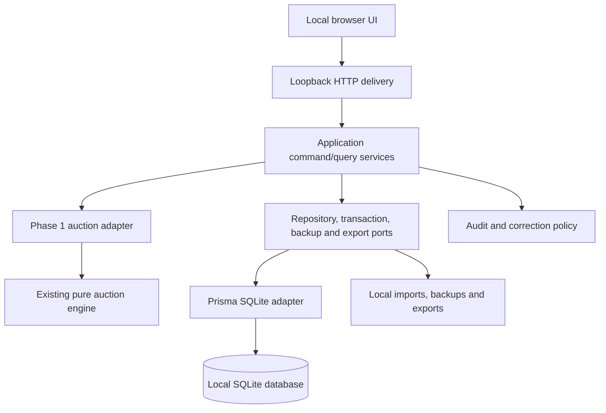
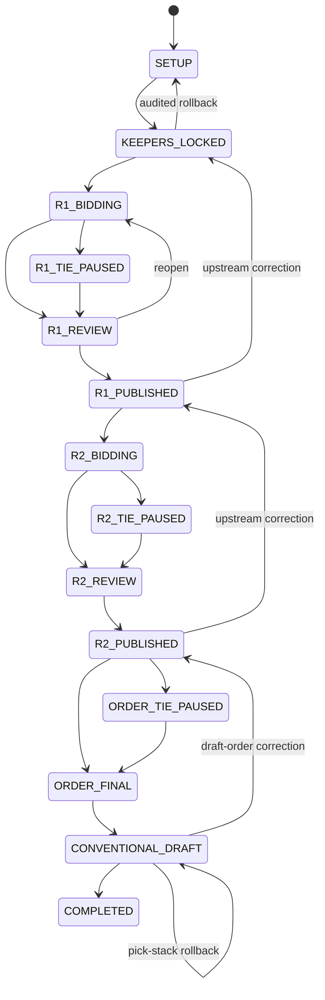
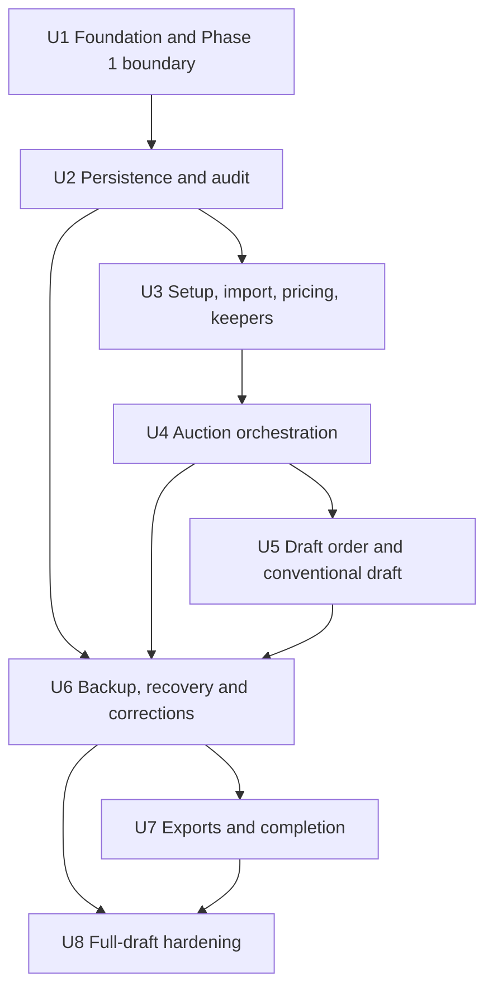

# Commissioner Draft Application - Phase 2 Plan

## Goal Capsule

- **Objective:** Build a private, single-computer web application that lets one commissioner configure and complete a real fantasy-football draft without internet access while preserving the accepted Phase 1 auction behavior.
- **Authority:** The accepted public behavior and complete test suite in `src/` and `test/` are the auction-domain authority. This plan governs the Phase 2 application around that boundary. If integration exposes a contradiction in Phase 1 semantics, implementation stops and reports it instead of changing the engine.
- **Execution profile:** Deep, persistence-bearing modular-monolith implementation with recovery, audit, exports, and end-to-end workflow coverage.
- **Stop conditions:** Stop rather than invent behavior if the accepted auction engine contradicts a Phase 2 requirement, a correction cannot preserve a complete audit trail, or a proposed data migration cannot preserve an existing draft.
- **Tail ownership:** Implementation remains review-gated. This document authorizes planning only until the user explicitly starts implementation after review.

---

## Product Contract

### Summary

Phase 2 is a localhost web application operated by one commissioner on draft day. It must create a season, prepare players and pricing, run keeper and auction phases through the existing deterministic engine, record external random results, complete a fixed-order conventional draft, recover after interruption, and export final results.

The application must work with the network disconnected. Every meaningful command is saved automatically and atomically. Corrections are compensating actions with audit history, never silent database edits.

### Problem Frame

Phase 1 proves the unusual auction allocation rules but provides no durable workflow around them. A real draft requires frozen inputs, lifecycle gates, recoverable state, commissioner controls, auditable tie decisions, correction boundaries, and exports. The chief risk is not screen construction; it is preventing partial or silent state changes while allowing a human commissioner to recover from mistakes and machine restarts.

### Key Decisions

- **Private single-computer operation for Phase 2** `(session-settled: user-directed — chosen over internet hosting: offline reliability and simple local deployment are the Phase 2 priorities)`. Governs R1, R2, R18, R19, R22.
- **Future multi-user evolution without core-domain replacement** `(session-settled: user-directed — chosen over a local-only architecture: Phase 3 accounts, sealed remote bidding, and realtime hosting must remain additive)`. Governs R3, R12, R23, R24.
- **Phase 1 auction semantics are pinned** `(session-settled: user-directed — chosen over opportunistic engine changes: Phase 1 is the accepted stable baseline)`. Governs R12, R13, R14, R28.

### Actors

- A1. **Commissioner:** The only Phase 2 human operator; configures, runs, corrects, backs up, and exports a draft.
- A2. **Application:** Validates commands, persists canonical state and audit history, invokes the Phase 1 engine, creates backups, and restores resumable context.
- A3. **External random method:** A physical or otherwise external process whose result is recorded by the commissioner for auction ties and draft-order ties.

### Requirements

**Local operation and durability**

- R1. The application runs on one computer and exposes its UI only through a local loopback address by default.
- R2. Every feature required to complete the draft works with no internet connection after installation and data import.
- R3. Phase 2 uses a modular monolith whose auction domain, application services, persistence, and web delivery are separate boundaries.
- R4. Every meaningful draft command commits its canonical state changes and one append-only audit event in the same database transaction.
- R5. Restarting the application or computer resumes the last committed season and workflow state without manual reconstruction.
- R6. The commissioner can create a verified database-consistent backup on demand and the application creates automatic checkpoints at defined high-risk transitions.
- R7. A backup includes the database snapshot, schema/application compatibility metadata, timestamp, checksum, season identifier, and a human-readable manifest.

**Season, teams, players, and pricing**

- R8. The commissioner can create multiple seasons, choose one active season, and configure a positive team count before draft activity begins.
- R9. Teams have stable franchise identity and season-specific display/order data; team count and participating teams become immutable once keeper decisions are locked unless the draft is rolled back to setup.
- R10. The commissioner can import players from a local CSV or JSON file, review validation failures before commit, and re-run a corrected import idempotently.
- R11. The player catalog supports NFL players and league-custom players. Eddie Gallagher is seeded or explicitly creatable as a league-custom K with no external NFL identifier.
- R12. The commissioner configures positive whole-dollar positional minimum prices. Imported or explicitly priced player values resolve to a positive whole-dollar `minimumBid` before an auction round can open.
- R13. The application maps teams, available players, budgets, starting rosters, bids, configured roster rules, and recorded tie precedence into the existing `resolveAuction` input without changing its public behavior.

**Keepers and auction rounds**

- R14. Each team may have zero or one keeper selected from eligible prior-roster data; a keeper costs $50, occupies roster capacity immediately, and makes that player unavailable.
- R15. Round 1 starting budget is $350 without a keeper and $300 with a keeper.
- R16. The commissioner can enter zero to three priority-ordered sealed bids for every team in a privacy mode that shows only the active team's contents. Leaving a team masks its players and amounts; league-wide summaries expose status and bid count but not contents until the round is locked. The commissioner validates while drafting, explicitly confirms zero-bid submissions, finalizes each team, and reviews the masked complete-round snapshot before lock.
- R17. Locked auction input is immutable. Corrections reopen the round through an audited rollback, invalidate derived resolution data, and require the round to be locked and resolved again.
- R18. Auction resolution persists the exact frozen engine input, engine output, eliminations, trace, input/output hashes, and engine contract version.
- R19. An unresolved auction tie pauses publication. The commissioner records the external method, participants, preferred team, note, and timestamp; the application reruns the same frozen input plus the recorded precedence until resolved or another tie is returned.
- R20. Auction awards charge the winner's submitted amount, create roster assignments, and update remaining budgets only when a resolved result is committed.
- R21. Round 2 starting budget for each team is exactly $150 plus that team's committed Round 1 remaining budget. Round 2 otherwise uses the same submission, lock, tie, resolution, review, and publication workflow.

**Draft order and conventional draft**

- R22. After Round 2, teams are ranked by remaining auction money descending. Equal balances pause order finalization until the commissioner records external random precedence for every tied group.
- R23. Once finalized, the permanent conventional draft order repeats unchanged every round; it is not a snake order.
- R24. The commissioner records one conventional pick at a time. A pick is accepted only for the team currently on the clock, an available player, and a resulting legal partial roster.
- R25. Conventional drafting ends only when every team has exactly 14 legal players under the configured roster rules.

**Correction, audit, recovery, and export**

- R26. Every correction records actor, action type, reason, affected entities, before/after summaries, correlation identifier, and the action it reverses or supersedes.
- R27. Conventional-pick undo is stack-based: undoing an earlier pick first invalidates that pick and every later pick, then resumes from the earliest affected draft position. Invalidated history remains readable.
- R28. Correcting keepers, auction inputs, auction outcomes, or draft order rolls the season back to the earliest affected workflow checkpoint and invalidates every derived downstream action without deleting audit history.
- R29. High-impact rollback requires an automatic pre-correction backup and a preview of invalidated downstream records before confirmation.
- R30. On startup, the application checks schema compatibility and database integrity, identifies any interrupted-but-uncommitted operation as rolled back, and presents a recovery summary for the last committed state.
- R31. The commissioner can export final rosters and draft history as deterministic CSV and JSON files. Exports contain season/team/player identifiers, acquisition source, cost where applicable, and draft position/pick where applicable.
- R32. Backup and export destinations are commissioner-selectable local folders; failure to write a file leaves canonical draft state unchanged and reports a retryable error.

### Key Flows

- F1. **Create and prepare a season**
  - **Trigger:** Commissioner starts a new season.
  - **Steps:** Create season → configure team count and teams → import/review players → configure pricing and roster rules → enter prior-roster eligibility → select keepers → run preflight → lock setup.
  - **Outcome:** A complete, internally consistent Round 1 starting state.
  - **Covered by:** R8–R15.
- F2. **Run an auction round**
  - **Trigger:** Commissioner opens Round 1 or Round 2.
  - **Steps:** Enter team submissions → finalize all submissions → lock frozen snapshot → invoke Phase 1 → record external tie precedence as needed → review resolved awards → publish/commit results.
  - **Outcome:** Immutable round awards, rosters, budgets, trace, and audit records.
  - **Covered by:** R13, R16–R21.
- F3. **Calculate draft order**
  - **Trigger:** Round 2 results are committed.
  - **Steps:** Rank balances → detect tied groups → record external ordering → finalize fixed order.
  - **Outcome:** One permanent team sequence used for every conventional round.
  - **Covered by:** R22–R23.
- F4. **Run the conventional draft**
  - **Trigger:** Fixed order is finalized.
  - **Steps:** Show current team → choose available player → validate roster → commit pick and audit event → advance in fixed order → repeat to complete rosters.
  - **Outcome:** Exactly 14 legal players per team and complete draft history.
  - **Covered by:** R24–R25.
- F5. **Restart and recover**
  - **Trigger:** Application starts with an existing database.
  - **Steps:** Verify compatibility/integrity → load active season → summarize last committed action and current checkpoint → resume the relevant screen.
  - **Outcome:** No accepted draft action must be re-entered.
  - **Covered by:** R4–R7, R30.
- F6. **Correct a mistake**
  - **Trigger:** Commissioner selects an audited action or domain object to correct.
  - **Steps:** Explain correction → calculate dependency impact → preview invalidations → create backup → confirm → execute compensating rollback transaction → resume at earliest affected checkpoint.
  - **Outcome:** Correct canonical state with intact original and corrective history.
  - **Covered by:** R26–R29.

### Acceptance Examples

- AE1. **Crash-safe pick** — Given Team A is on the clock, when its legal pick returns success and the process is immediately terminated, then restart shows the pick, the next team on the clock, and the matching audit event. Covers R4, R5, R24, R30.
- AE2. **No partial auction commit** — Given a frozen auction round, when engine resolution or persistence fails, then no award, budget, roster, or published-round state is partially committed. Covers R4, R18–R20.
- AE3. **Round 2 budget** — Given Round 1 remaining balances of $0, $75, and $200, when Round 2 is opened, then starting budgets are $150, $225, and $350. Covers R21.
- AE4. **External auction tie** — Given Phase 1 returns an unresolved tie, when the commissioner records precedence and resumes resolution, then the persisted result is reproducible from the frozen input plus tie records. Covers R18–R19.
- AE5. **Fixed order** — Given order A, B, C, when four picks are committed, then teams on the clock are A, B, C, A. Covers R23–R24.
- AE6. **Cascading correction** — Given Round 1, Round 2, draft order, and five conventional picks exist, when a Round 1 bid is corrected, then the preview includes every derived downstream record and confirmed rollback invalidates them while retaining their audit history. Covers R17, R26, R28–R29.
- AE7. **Offline completion** — Given dependencies and player import files are already local, when all network adapters are unavailable, then a season can progress from setup through final export. Covers R1–R2, R31–R32.
- AE8. **Custom kicker** — Given Eddie Gallagher is present as `LEAGUE_CUSTOM` and position K, when selected as keeper, auction award, or conventional pick, then the same availability and roster rules apply as for any kicker. Covers R11, R13–R14, R24.
- AE9. **Sealed commissioner entry** — Given Team A's bid form has been finalized, when the commissioner navigates to Team B or the round summary before lock, then Team A's player names and amounts are masked; after lock the explicit reveal/review screen can show the frozen submissions, and reopening remasks them for correction. Covers R16–R17.

### Success Criteria

- A commissioner can complete a representative full draft locally without editing files or database rows.
- Killing and restarting the application after every state-changing command in an automated lifecycle test never loses a committed action or produces partial state.
- Every canonical state mutation can be traced to exactly one append-only audit event and correlation identifier.
- A fresh restore from every automatic checkpoint passes integrity checks and resumes at the expected workflow checkpoint.
- Phase 1's existing suite remains unchanged and green throughout Phase 2.

### Scope Boundaries

**Deferred to Phase 3 or later**

- Owner accounts, authentication, authorization roles, and owner self-service.
- Remote sealed bidding and bid secrecy between networked clients.
- Realtime multi-browser updates, hosted deployment, WebSockets, or managed realtime services.
- ESPN integration.
- Automated player-price generation or internet player feeds.

**Explicitly excluded from Phase 2**

- Changing the accepted auction allocation semantics to simplify application integration.
- Editing database rows as a supported correction mechanism.
- Snake-order conventional drafting.
- Runtime dependence on any cloud service.

### Sources

- Existing domain boundary and public contract: `README.md`, `src/index.js`, `src/auction.js`, `src/roster.js`.
- Accepted engine coverage: `test/golden.test.js`, `test/properties.test.js`, `test/roster.test.js`.
- SQLite transactions: `https://www.sqlite.org/lang_transaction.html`.
- SQLite consistent live backups: `https://www.sqlite.org/backup.html`.
- SQLite journaling considerations: `https://www.sqlite.org/wal.html`.
- Prisma transactions and supported SQLite/PostgreSQL connectors: `https://www.prisma.io/docs/orm/prisma-client/queries/transactions`, `https://docs.prisma.io/docs/orm/reference/supported-databases`.

---

## Planning Contract

### Key Technical Decisions

- KTD1. **Pinned local web stack and loopback deployment.** Use the existing npm package as the workspace root; add an npm workspace at `apps/commissioner/`. Build a TypeScript Node modular monolith with Fastify HTTP delivery, React + Vite browser UI, Vitest service/component tests, and Playwright browser tests. Build static assets into the server distribution, bind to `127.0.0.1`, store mutable data under a commissioner-selected local application-data directory outside source/install files, and expose one `npm run commissioner:start` production command. Delivery calls application services; it never writes persistence directly. This instantiates the private-computer product decision for R1–R3.
- KTD2. **Preserve the Phase 1 package boundary.** Keep the root `src/index.js` exports and all existing tests as the authoritative auction domain. Add adapter and characterization tests around mapping and persistence rather than moving or rewriting the engine. This instantiates the pinned-engine decision for R13, R18–R19, R28.
- KTD3. **SQLite through a replaceable repository boundary.** Use file-backed SQLite in rollback-journal mode through Prisma with `@prisma/adapter-better-sqlite3`; use the same underlying `better-sqlite3` library for maintenance backup, verification, and restore operations. A single process owns the database, and the command executor serializes writes. Application services depend on repository interfaces and transaction ports, not Prisma types. Keep identifiers application-generated and avoid SQLite-only domain assumptions so a future PostgreSQL adapter/migration does not replace domain or service logic. Prisma officially supports both SQLite and PostgreSQL.
- KTD4. **Short atomic command transactions.** Every state-changing request is a named application command with an idempotency key. It validates current lifecycle/version, writes canonical tables, and appends `AuditEvent` in one short transaction. Network or filesystem work never occurs inside that transaction.
- KTD5. **Frozen snapshots at derivation boundaries.** Keeper lock, auction lock, resolved auction, draft-order finalization, and conventional-draft start each record immutable input/output snapshots with hashes and a contract version. Derived records point to their source snapshot.
- KTD6. **Canonical tables plus append-only audit, not full event sourcing.** Current state remains queryable in normalized tables. `AuditEvent` and `CorrectionAction` retain intent, before/after summaries, and supersession links. Rollback uses domain-specific compensating services, avoiding the complexity of reconstructing every read model from events while preserving history.
- KTD7. **Checkpoint rollback for upstream corrections.** Corrections calculate a dependency cut. Conventional picks can unwind from the latest pick. Keeper, auction, or order corrections invalidate all downstream derived state and restore the last canonical checkpoint before the corrected input. Invalidated records are marked superseded; they are not deleted.
- KTD8. **Concrete consistent backup and restore protocol.** The maintenance coordinator pauses new commands and drains the in-process command queue, then uses `better-sqlite3`'s SQLite Online Backup API wrapper to write a temporary database on the same local filesystem. It runs `PRAGMA integrity_check` against a separate read-only connection, computes SHA-256, writes the manifest, and atomically promotes the temp database and manifest. Restore verifies checksum/schema/app compatibility in a scratch location, creates a safeguard backup of the current database, closes Prisma and all SQLite connections, renames the current database to a retained rollback copy, promotes the candidate, reopens and verifies it, and restores the original copy if activation fails. Automatic checkpoints occur before setup lock, each auction lock/resolution publication, draft-order finalization, conventional-draft start, high-impact correction, and final export.
- KTD9. **File import and export at application edges.** Support one documented canonical CSV schema and one canonical JSON schema with tolerant unknown columns and row-level errors. NFL identity is `(sourceType, sourceNamespace, externalId)`; league-custom players use application-generated IDs and can never be overwritten by imports. A repeated identical file hash is a no-op. A corrected file creates a new batch that supersedes the previous active batch for the same season/namespace, updates matching season projections, and routes identity collisions or external-ID changes to explicit review. Generate deterministic final-roster exports from a read snapshot and write using a temporary file plus atomic rename where supported; file failure never alters draft state.
- KTD11. **Copy-migrate-promote startup upgrades.** Before accepting commands, the startup coordinator reads compatibility metadata without migrating. It rejects a database created by a newer application, creates and verifies a backup of an older database, restores that backup to a candidate file, runs Prisma migrations against the candidate, verifies schema and integrity, then atomically promotes and opens it. The untouched original and backup remain available if migration or activation fails. Released schema fixtures and injected migration failures test this protocol.
- KTD10. **No Phase 2 identity shortcut in the domain.** Commands carry a commissioner actor descriptor even though no login exists. The delivery adapter supplies a local commissioner identity. Phase 3 may replace that adapter with authenticated principals without altering command/service contracts.
- KTD12. **Explicit SQLite durability policy.** At startup the SQLite adapter enforces `foreign_keys=ON`, `journal_mode=DELETE`, `synchronous=FULL`, and a bounded `busy_timeout`; one application process and one serialized write queue avoid multi-writer ambiguity. A success receipt is emitted only after SQLite reports commit. Forced-process tests prove process-crash recovery. Hard-power-loss durability is bounded by SQLite, filesystem, storage hardware, and OS guarantees and is supplemented by verified checkpoints rather than overstated as absolute.
- KTD13. **Version-bound correction previews and typed dependency lineage.** Every derived entity carries its source snapshot/checkpoint and supersession link. A typed dependency registry enumerates descendants for each correction class. `CorrectionAction` stores the season version, dependency-cut hash, preview manifest, and backup hash. Confirmation requires the same aggregate version, recomputes the dependency cut inside the rollback transaction, and rejects stale previews. Canonical descendants are superseded explicitly; snapshot rebuild is used only to calculate/verify the target state, not to erase lineage.
- KTD14. **Windows 11 x64 offline distribution contract.** Phase 2 ships a self-contained Windows 11 x64 folder/installer containing the tested Node runtime, production server/UI assets, Prisma engine, and native SQLite dependency; draft-day startup downloads nothing. `Start League Draft.cmd` launches the loopback server, selects the configured port or reports a collision with a safe alternate, opens the browser, and shows data/backup locations. Graceful stop closes database connections; an abrupt stop remains recoverable. Default mutable data lives under `%LOCALAPPDATA%\LeagueDraft`, never inside the install directory. Updates create a pre-migration backup and do not overwrite data. Phase 3 guarantees reuse of Phase 1 and application command/query contracts, not physical SQLite migrations.

### High-Level Technical Design

The browser is a replaceable delivery surface. Application services express lifecycle commands such as `lockAuctionRound`, `recordAuctionTieDecision`, `commitConventionalPick`, and `rollbackToCheckpoint`. The persistence adapter implements those services' repository contracts with one SQLite transaction per command. Phase 3 adds authenticated delivery and hosted persistence at the outer boundaries.

### Workflow State Model

Transitions are commands guarded by the current state and `rowVersion`. A transition and its audit event commit together. Restart reads the committed state; there is no separate in-memory workflow authority.

### Proposed Data Model

| Entity | Key fields and relationships | Purpose / invariants |
|---|---|---|
| `League` | `id`, `name` | Stable parent for seasons; one local league initially. |
| `Season` | `id`, `leagueId`, `year`, `name`, `state`, `teamCount`, `rowVersion`, timestamps | Workflow aggregate root. State and version gate commands. |
| `Team` | `id`, `leagueId`, `franchiseName` | Stable franchise identity across seasons. |
| `SeasonTeam` | `id`, `seasonId`, `teamId`, `displayName`, `seedOrder`, `active` | Season participation and configurable count. Unique season/team. |
| `Player` | `id`, `sourceType`, `externalId?`, `name`, `position`, `nflTeam?`, `active` | Stable player identity. `sourceType` includes `NFL` and `LEAGUE_CUSTOM`; Eddie Gallagher is a custom K. |
| `SeasonPlayer` | `id`, `seasonId`, `playerId`, `explicitMinimum?`, `resolvedMinimum`, `available`, import metadata | Season availability and resolved whole-dollar minimum. |
| `PositionPriceRule` | `id`, `seasonId`, `position`, `minimumBid` | Positive whole-dollar positional floor, unique by season/position. |
| `PriorRosterEligibility` | `id`, `seasonId`, `seasonTeamId`, `playerId`, source note | Defines keeper eligibility without coupling to a prior-season import model. |
| `Keeper` | `id`, `seasonId`, `seasonTeamId`, `playerId`, `cost=50`, `lockedAt`, `supersededAt?` | Zero/one active keeper per season team; player unique among active assignments. |
| `RosterAssignment` | `id`, `seasonId`, `seasonTeamId`, `playerId`, `sourceType`, `sourceId`, `cost?`, `active`, timestamps | Canonical ownership from keeper, auction, or conventional pick. Unique active player assignment per season. |
| `AuctionRound` | `id`, `seasonId`, `roundNumber`, `state`, `lockedSnapshotId?`, `publishedResolutionId?`, timestamps | Exactly rounds 1 and 2. |
| `AuctionTeamBudget` | `id`, `auctionRoundId`, `seasonTeamId`, `starting`, `spent`, `remaining` | Persisted accounting with check `starting-spent=remaining`. Round 2 source links to Round 1 result. |
| `AuctionSubmission` | `id`, `auctionRoundId`, `seasonTeamId`, `state`, `finalizedAt?`, `rowVersion` | One sealed submission per team. Zero bids is valid. |
| `AuctionBid` | `id`, `submissionId`, `playerId`, `priority`, `amount`, `supersededAt?` | Zero-to-three active bids; unique priority and player per active submission. |
| `FrozenSnapshot` | `id`, `seasonId`, `kind`, `schemaVersion`, `payloadJson`, `sha256`, `createdAt`, `sourceAuditEventId` | Immutable derivation boundary for engine inputs, outputs, order inputs, and recovery checkpoints. |
| `AuctionResolution` | `id`, `auctionRoundId`, `inputSnapshotId`, `outputSnapshotId`, `engineContractVersion`, `status`, `attemptNumber`, timestamps | Reproducible Phase 1 invocation and trace. Only one published active resolution per round. |
| `AuctionTieCase` | `id`, `auctionResolutionId`, `playerId`, `amount`, `participantSetHash`, `state` | Persisted unresolved tie returned by Phase 1. |
| `ExternalTieDecision` | `id`, `contextType`, `contextId`, `participantsJson`, `precedenceJson`, `method`, `note`, `recordedAt`, `supersededAt?` | Auction or order precedence. Never grants affordability/legality. |
| `DraftOrder` | `id`, `seasonId`, `sourceSnapshotId`, `finalizedAt`, `supersededAt?` | One active permanent order. |
| `DraftOrderEntry` | `id`, `draftOrderId`, `seasonTeamId`, `position`, `balance` | Unique position/team within active order. |
| `ConventionalDraft` | `id`, `seasonId`, `draftOrderId`, `state`, `nextOverallPick`, `rowVersion` | Current draft cursor and completion state. |
| `DraftPick` | `id`, `conventionalDraftId`, `overallPick`, `roundNumber`, `orderPosition`, `seasonTeamId`, `playerId`, `active`, `supersededAt?` | Fixed-order pick history; unique active overall pick and player. |
| `AuditEvent` | `id`, `seasonId`, `sequence`, `actorType`, `actorLabel`, `commandType`, `entityType`, `entityId`, `correlationId`, `idempotencyKey`, `reason?`, `beforeJson?`, `afterJson?`, `createdAt` | Append-only command history; unique sequence and idempotency key. |
| `CorrectionAction` | `id`, `seasonId`, `requestedAuditEventId`, `rollbackCheckpointId`, `impactJson`, `reason`, `confirmedAt`, `resultAuditEventId` | Preview and executed correction lineage. |
| `Checkpoint` | `id`, `seasonId`, `kind`, `seasonVersion`, `stateSnapshotId`, `sourceAuditEventId`, `createdAt`, `supersededAt?` | First-class canonical rollback boundary. Derived records reference the checkpoint/snapshot that produced them. |
| `BackupRecord` | `id`, `seasonId?`, `path`, `sha256`, `schemaVersion`, `applicationVersion`, `trigger`, `verifiedAt`, `createdAt` | Catalog of verified snapshots; the manifest also travels beside the backup file. |
| `ImportBatch` / `ImportRow` | batch source hash, format, state; staged normalized/raw data and errors | Previewable, idempotent local import with complete row-level feedback. |
| `ExportRecord` | `id`, `seasonId`, `format`, `path`, `sha256`, `snapshotId`, `createdAt` | Reproducible final or on-demand export metadata. |

Use database uniqueness, foreign keys, check constraints where portable, and service-level invariant checks. JSON columns store immutable snapshots and audit summaries, not primary relational state.

### Screen and Workflow Map

| Screen | Primary actions | Guards and recovery behavior |
|---|---|---|
| Launch & Recovery | Create/open season, verify database, restore backup, resume active draft | Shows schema/integrity result, last audit action, last verified backup, and current checkpoint. |
| Seasons | Create, archive, select season | No destructive delete after draft activity; archive only. |
| Setup Overview | See readiness checklist and navigate setup | Blocks keeper lock until team/player/pricing/roster preflight passes. |
| Teams | Set count, create/reorder teams | Locked after keeper phase; correction routes through rollback preview. |
| Player Import & Catalog | Upload canonical local CSV/JSON, validate/preview/commit, resolve identity collisions, manage custom players | Eddie Gallagher custom-K fixture/entry visible; imported rows never partially commit and never overwrite custom players. |
| Pricing & Roster Rules | Configure positional minimums and roster limits | Positive integer checks and Phase 1-compatible roster-rule preview. |
| Keeper Setup | Enter eligibility and choose zero/one keeper per team | Live roster-capacity and uniqueness validation; lock creates Round 1 budgets. |
| Draft Control Center | Current lifecycle, completion checklist, backups, audit alerts | Single landing screen after restart; only legal next transitions enabled. |
| Auction Round Entry | Privacy-mode team tabs, priorities 1–3, validation, finalize/unfinalize before lock; league-wide summary shows every team, bid count, validation, and explicit zero-bid confirmation without names, amounts, priorities, or exposure | Leaving a team masks its contents; direct links repair incomplete teams; explicit reveal of the frozen snapshot is available only after lock. Reopen remasks corrected submissions. |
| Auction Tie Resolution | Tie group, player/amount, external method/result form | Records precedence only; reruns same snapshot and may surface a smaller new tie. |
| Auction Review | Awards, budgets, eliminations, trace, publish or reopen | Publish is transactional; reopen requires reason and invalidates draft resolution. |
| Draft Order | Balance ranking, tied groups, external order recording, finalize | Fixed order preview repeated over multiple rounds before finalization. |
| Conventional Draft Board | On-the-clock team, player search, roster needs, picks, undo latest | Server validates availability and roster; each committed pick autosaves. |
| Corrections & Audit | Timeline, filter, select correction, impact preview, confirm rollback | Preview names/counts invalidated bids, awards, budgets, tie decisions, order, picks, completion, and exports; shows resume checkpoint, required re-entry, and backup ID. Cascade corrections require a typed confirmation and end with a recovery checklist. |
| Backup, Restore & Export | Create/verify backup, choose restore manifest, preview compatibility/checkpoint, safeguard current database, activate verified restore, export final rosters as CSV/JSON | Restore uses a wizard with explicit confirmation and success receipt; candidate activates only after scratch verification, and both copies remain on failure. File writes record metadata only after verification. |
| Draft Complete | Final roster validation, export bundle, reopen via correction | Completion is blocked until all teams have exactly 14 legal players. |

Every state-changing screen uses one command-status pattern: disable duplicate submission while pending, show a durable `Saved` receipt with audit sequence and committed time, offer retry only for uncommitted failures, explain idempotent recovery after uncertain transport failure, and show a stale-version dialog that reloads canonical state while preserving safe unsubmitted form input.

### Local Deployment Experience

1. Install or unzip the signed/checksummed Windows 11 x64 offline bundle once; no Node or package-manager installation is required on draft day.
2. Launch `Start League Draft.cmd`. It validates the local runtime/data directory, starts on the configured loopback port, offers a safe alternate on collision, and opens the browser.
3. The recovery screen displays application/database versions, active season, data directory, backup directory, last committed audit action, and safe-shutdown status.
4. Use the in-app Stop control or close the launcher for graceful shutdown. Abrupt termination is treated as a restart-recovery case, not as an exceptional manual procedure.
5. Updates run from a separate versioned install directory, create a verified pre-migration backup, migrate through copy-migrate-promote, and leave the prior executable/data rollback path intact.

### Recovery and Undo Strategy

#### Automatic save and restart recovery

1. The browser sends a named command with a client-generated idempotency key and expected aggregate version.
2. The server validates the lifecycle and domain rules.
3. One database transaction changes canonical state, increments the aggregate version, and appends the audit event.
4. Success returns only after commit. Retrying the same idempotency key returns the previously committed result.
5. Startup verifies migration compatibility, runs a fast integrity check, loads the active season and last audit sequence, and routes to the screen for the committed lifecycle state.
6. Filesystem jobs such as backup/export use an out-of-transaction job record. An interrupted job is retryable and cannot imply that a missing file exists.

#### Startup migration recovery

1. Open only enough metadata to compare database and application compatibility; never auto-downgrade a newer database.
2. Create and verify a consistent pre-migration backup.
3. Restore the backup into a candidate database and run pending Prisma migrations only against that candidate.
4. Run schema checks and `PRAGMA integrity_check` against the migrated candidate.
5. Close maintenance connections, retain the original as a rollback copy, atomically promote the candidate, and open normal Prisma services.
6. On any failure, keep the original active, retain diagnostic and backup records, and show a recovery action instead of accepting draft commands.

#### Undo classes

- **Latest conventional pick:** One compensating command marks the pick and roster assignment superseded, restores player availability, rewinds the cursor, and appends an audit event.
- **Earlier conventional pick:** Preview and invalidate that pick plus every later active pick in reverse order. Resume on the earliest affected pick number; the commissioner re-enters subsequent picks.
- **Unpublished auction result:** Reopen the round, supersede resolution/tie records, retain the frozen input for audit, permit bid correction, and require new lock/resolution.
- **Published Round 1 or Round 2 correction:** Roll back to the last checkpoint before that round's lock, invalidate downstream awards/budgets/order/picks, and rerun from corrected inputs.
- **Keeper/team/player/pricing correction:** Roll back to setup or keeper checkpoint and invalidate every derived downstream object.
- **Draft-order correction:** Invalidate the order and all conventional picks, preserve auction results, and re-finalize order.
- **Completed draft correction:** Same dependency rules apply; completion/export records are superseded and regenerated after the corrected draft completes.

Every high-impact correction first creates and verifies a backup, stores an impact manifest, requires a reason, and executes as one transaction. No correction edits historical `AuditEvent` rows.

#### Correction concurrency protocol

1. Preview captures current `Season.rowVersion`, the typed dependency cut, its SHA-256 hash, expected resume checkpoint, and re-entry checklist.
2. The application creates a verified backup tagged with that version and cut hash.
3. Confirmation submits the preview ID, version, cut hash, backup hash, typed confirmation, and reason.
4. The rollback transaction locks/checks the season version, recomputes the complete dependency cut, and compares the hash before changing state.
5. Any mismatch rejects the correction and returns a fresh preview; no partial invalidation occurs.
6. A successful correction supersedes every typed descendant, activates the target checkpoint state, appends one correlated audit group, and shows the resume/re-entry checklist and backup identifier.

### Sequencing

### System-Wide Impact

- The root package becomes the stable domain dependency of a new application workspace; its exports and tests remain unchanged.
- Persistent lifecycle state makes migrations and backward-compatible startup behavior release-critical.
- Audit, backup, and correction services touch every state-changing capability and must be built before end-to-end acceptance.
- The lack of authentication is an explicit Phase 2 delivery assumption, not a domain assumption; commands already carry actor and idempotency data.

### Risks and Mitigations

| Risk | Consequence | Mitigation |
|---|---|---|
| Phase 2 adapter accidentally changes auction semantics | Historical results drift | Pin existing tests; add adapter contract fixtures comparing direct engine calls with persisted orchestration. Stop on contradiction. |
| Weak or inconsistent SQLite durability/backup settings | Last acknowledged action or backup may be lost | Enforce the KTD12 pragmas, serialize writes, use the Online Backup API, integrity/checksum verification, and process-crash plus restore tests. |
| Upstream correction leaves derived data active | Invalid rosters/budgets/order | Central dependency-impact service, checkpoint graph, transactionally supersede all descendants, end-to-end cascade tests. |
| Browser retries duplicate a pick or transition | Duplicate ownership or skipped turn | Idempotency key plus aggregate version and uniqueness constraints. |
| Local-only shortcuts leak into domain | Phase 3 rewrite | Actor/season-scoped command and query contracts, repository contract tests, ports/adapters, and no UI or Prisma types in domain/application interfaces. Physical schema portability is not promised. |
| Correction preview becomes stale before confirmation | Active descendants survive rollback | Version/cut-hash binding, in-transaction recomputation, stale rejection, and two-tab tests for every correction class. |
| Player import contains changed or duplicate identities | Keeper or availability corruption | Canonical CSV/JSON schemas, source namespace/external-ID identity, staged validation, unknown-column tolerance, collision review, and protected custom-player IDs. |
| Schema upgrade makes old draft unreadable | Loss of recovery | Migrations tested from prior fixture databases; automatic pre-migration backup; fail closed on newer schema. |
| Backup exists but cannot restore | False confidence | Verification plus automated restore drill against copies at every checkpoint class. |

---

## Implementation Units

### U1. Application foundation and pinned auction boundary

- **Goal:** Establish the TypeScript modular-monolith workspace and a tested adapter around the unchanged Phase 1 exports.
- **Requirements:** R1–R3, R13, R28.
- **Files:** `package.json`, `apps/commissioner/package.json`, `apps/commissioner/src/server/`, `apps/commissioner/src/application/ports/`, `apps/commissioner/src/integrations/auction-engine-adapter.ts`, `apps/commissioner/test/auction-engine-adapter.test.ts`.
- **Approach:** Add npm workspace scripts without moving `src/` or changing its exports. Pin the KTD1 stack, implement the production loopback launcher/data-directory contract, introduce typed Phase 2 DTOs and explicit mapping to/from `resolveAuction`, and spike KTD12 durability plus KTD8 backup/restore against the selected Prisma/better-sqlite3 stack before schema expansion. Characterize every approved Phase 1 result used by application orchestration.
- **Execution note:** Treat all existing Phase 1 tests as immutable regression evidence; add new tests outside `test/` unless a contradiction is found.
- **Test scenarios:** Direct versus adapter result equality; unknown position/minimum/budget mapping errors; unresolved tie round trip; supplied precedence round trip; trace/hash stability; Windows offline bundle starts with no installed Node/network; default/custom data directory; port collision; safe stop; forced process death; durability pragmas; online backup and staged restore spike.
- **Verification:** Existing `node --test`; commissioner application typecheck and adapter tests.
- **Dependencies:** None.

### U2. SQLite schema, transaction boundary, lifecycle, and audit

- **Goal:** Persist canonical season state with atomic command/audit transactions and restart-safe lifecycle transitions.
- **Requirements:** R4–R5, R8–R9, R18, R26, R30.
- **Files:** `apps/commissioner/prisma/schema.prisma`, `apps/commissioner/prisma/migrations/`, `apps/commissioner/src/application/commands/`, `apps/commissioner/src/application/audit/`, `apps/commissioner/src/infrastructure/sqlite/`, `apps/commissioner/test/persistence/`.
- **Approach:** Implement the core data model, repository ports, Prisma SQLite adapter, idempotent serialized command executor, row-version checks, append-only audit enforcement, checkpoint/source lineage, repository contract suite, and state-machine guards. Every command/query carries actor and season scope. Seed no active draft automatically.
- **Test scenarios:** Atomic rollback on command error; duplicate idempotency key; stale row version; illegal transition; audit event paired with every mutation; restart at every lifecycle state; migration from empty database; upgrade every released schema fixture through copy-migrate-promote; injected migration failure retains the original; fail closed on newer schema.
- **Verification:** Migration check against a new database, persistence integration suite, restart characterization.
- **Dependencies:** U1.

### U3. Season setup, local player import, pricing, and keepers

- **Goal:** Produce a preflight-clean, locked keeper state and correct Round 1 starting budgets.
- **Requirements:** R8–R15.
- **Files:** `apps/commissioner/src/application/setup/`, `apps/commissioner/src/application/imports/`, `apps/commissioner/src/application/keepers/`, `apps/commissioner/src/routes/setup/`, `apps/commissioner/src/ui/setup/`, `apps/commissioner/test/setup/`, `apps/commissioner/test/imports/`.
- **Approach:** Build staged canonical CSV/JSON imports, source-namespace/external-ID collision review, catalog/custom-player editing, positional price resolution, team setup, keeper eligibility, and preflight. Include Eddie Gallagher as explicit league-custom K seed/fixture data, not an NFL import exception.
- **Test scenarios:** Team counts at configured boundaries; duplicate teams; valid/invalid CSV and JSON; identical no-op re-import; corrected superseding import; duplicates across batches; external-ID change review; custom-versus-import collision; unknown positions; missing positional floor; explicit player minimum; Eddie Gallagher lifecycle; zero/one keeper; duplicate keeper player; keeper roster overflow; $350/$300 budgets; locked-setup edit rejection.
- **Verification:** Setup service tests, import integration tests using local fixtures, browser flow from empty database to keeper lock.
- **Dependencies:** U2.

### U4. Auction round orchestration and tie workflow

- **Goal:** Run both auction rounds through frozen inputs and the existing engine, including external tie precedence and publication.
- **Requirements:** R13, R16–R21.
- **Files:** `apps/commissioner/src/application/auction/`, `apps/commissioner/src/routes/auction/`, `apps/commissioner/src/ui/auction/`, `apps/commissioner/test/auction/`, `apps/commissioner/test/fixtures/phase1/`.
- **Approach:** Implement draft/finalized team submissions, round lock, snapshot hashing, engine adapter invocation, persisted attempts/traces, tie pause/decision/resume, result review, and transactional publication. Derive Round 2 budgets only from committed Round 1 balances.
- **Test scenarios:** Zero-to-three bids; private team entry masks other submissions; masked league summary; explicit post-lock reveal; reopen remasks; partial team finalization; lock guard; exact adapter fixtures for all 31 approved scenarios; unresolved and shrinking ties; invalid external decision; publication retry; engine failure with no partial state; reopen unpublished result; Round 2 budget table; deterministic rerun from stored snapshot.
- **Verification:** Auction application-service suite plus browser flow for both rounds and forced ties; unchanged Phase 1 suite.
- **Dependencies:** U3.

### U5. Permanent draft order and fixed-order conventional draft

- **Goal:** Calculate externally tie-resolved permanent order and complete legal fixed-order drafting.
- **Requirements:** R22–R25.
- **Files:** `apps/commissioner/src/application/draft-order/`, `apps/commissioner/src/application/conventional-draft/`, `apps/commissioner/src/routes/draft/`, `apps/commissioner/src/ui/draft/`, `apps/commissioner/test/draft-order/`, `apps/commissioner/test/conventional-draft/`.
- **Approach:** Rank committed Round 2 balances, group ties, record explicit group precedence, freeze order, compute current team from overall-pick modulo team count, validate selections through the shared roster validator, and complete only at exact roster targets.
- **Test scenarios:** Unique balances; two/multi-team ties; multiple independent tie groups; invalid/missing precedence; A-B-C-A fixed order; unavailable player; wrong team; roster overflow/FLEX; idempotent pick retry; exact 14-player completion; no snake reversal.
- **Verification:** Order and pick service tests, browser draft loop across multiple rounds, full roster validator regression.
- **Dependencies:** U4.

### U6. Backup, restart recovery, correction, and audited rollback

- **Goal:** Make every lifecycle checkpoint recoverable and every supported correction explicit, previewable, and reversible.
- **Requirements:** R5–R7, R17, R26–R30, R32.
- **Files:** `apps/commissioner/src/application/backups/`, `apps/commissioner/src/application/recovery/`, `apps/commissioner/src/application/corrections/`, `apps/commissioner/src/infrastructure/files/`, `apps/commissioner/src/routes/operations/`, `apps/commissioner/src/ui/operations/`, `apps/commissioner/test/recovery/`, `apps/commissioner/test/corrections/`.
- **Approach:** Implement verified Online Backup API snapshots, staged restore/rescue rollback, manifest/checksum, startup health/recovery summary, first-class checkpoints, typed dependency registry, version/cut-hash-bound impact previews, latest/earlier pick unwind, and upstream cascade rollback. Supersede rather than delete derived history.
- **Test scenarios:** Forced process restart after each command; interrupted backup; crash at every staged-restore step; clean-machine manual restore; restore each checkpoint; restore candidate activation failure preserves both copies; corrupted/incompatible backup rejection; latest/earlier pick undo; auction reopen; Round 1 correction after Round 2 and picks; keeper correction after draft activity; draft-order correction; concurrent-tab mutation makes every correction preview stale and harmless; backup-before-correction failure blocks rollback; audit lineage completeness.
- **Verification:** Recovery matrix using copied databases and child-process kill/restart tests; correction integration suite.
- **Dependencies:** U2, U4, U5.

### U7. Completion and deterministic CSV/JSON exports

- **Goal:** Validate completion and produce reproducible local artifacts for final rosters and draft history.
- **Requirements:** R25, R31–R32.
- **Files:** `apps/commissioner/src/application/exports/`, `apps/commissioner/src/infrastructure/files/export-writer.ts`, `apps/commissioner/src/routes/exports/`, `apps/commissioner/src/ui/exports/`, `apps/commissioner/test/exports/`.
- **Approach:** Trigger and verify the required pre-export backup, query one read snapshot, validate exact legal rosters, serialize canonical JSON and stable-column CSV, write temp/rename, hash, and then record export metadata. Include acquisition source, auction cost, and conventional pick metadata. Export only active final rosters in Phase 2; audit remains available in the application.
- **Test scenarios:** Pre-export backup failure blocks export; deterministic byte-for-byte replay; CSV escaping; custom player export; auction costs; fixed-order pick metadata; incomplete roster rejection; unwritable destination; interrupted temp file; correction followed by regenerated export.
- **Verification:** Golden CSV/JSON fixtures and restore/re-export equality.
- **Dependencies:** U6.

### U8. Complete-draft browser workflow and offline hardening

- **Goal:** Prove the application can run a real representative draft locally from empty database through verified exports.
- **Requirements:** R1–R32.
- **Files:** `apps/commissioner/e2e/`, `apps/commissioner/test/fixtures/full-draft/`, `apps/commissioner/scripts/package-local.*`, `apps/commissioner/README.md`.
- **Approach:** Add browser-driven full-lifecycle tests, offline checks, packaged local-start instructions, backup/restore drills, accessibility and high-risk confirmation review, and a no-network smoke environment. Exercise corrections at each major checkpoint.
- **Test scenarios:** Happy-path complete draft; auction tie and order tie; restart during every phase; Round 1 cascade correction after conventional picks; restore onto a clean application data directory; Eddie Gallagher acquisition/export; network disabled; browser refresh/retry; two accidentally opened tabs causing stale-version rejection rather than duplicate action.
- **Verification:** Full application suite, browser E2E suite, offline smoke, Phase 1 suite, clean-database install/start/restore/export rehearsal.
- **Dependencies:** U6, U7.

---

## Verification Contract

| Gate | Applies to | Required result |
|---|---|---|
| `node --test` | Every unit | Existing Phase 1 tests pass unchanged: no failures or semantic fixture edits. |
| `npm run commissioner:typecheck` and `npm run commissioner:test` | U1–U8 | TypeScript, application-service, UI-component, adapter, and real-SQLite integration tests pass. |
| `npm run commissioner:e2e` | U3–U8 | Playwright drives the built Fastify + React application through required browser workflows. |
| `npm run commissioner:build` and `npm run commissioner:start` | U1, U8 | Production assets build and the loopback application starts using the configured local data directory. |
| SQLite integration suite | U2–U8 | Tests use real temporary SQLite databases, foreign keys enabled, and actual migrations; no repository mocks for transaction/audit behavior. |
| Browser E2E suite | U3–U8 | Setup, both auction rounds, ties, order, fixed draft, corrections, backup, restore, and exports pass through the real server and browser. |
| Restart matrix | U2, U4–U8 | Termination after each committed command restores the exact last committed state; termination before commit exposes no partial state. |
| Backup restore matrix | U6–U8 | Every checkpoint class restores into a clean data directory, passes integrity/migration checks, and resumes correctly. |
| Offline smoke | U1, U3, U8 | Packaged application starts and completes the representative lifecycle with outbound network disabled. |
| Deterministic artifacts | U4, U7 | Same frozen inputs and decisions produce identical engine snapshots and byte-identical normalized exports. |

Implementation must add package-manager-specific commands to the root scripts during U1 and update this table only if the plan itself is reviewed again; executors record actual commands in verification output, not as progress edits to this plan.

---

## Definition of Done

### Global

- All R1–R32 acceptance behavior is implemented without adding excluded Phase 3 features.
- Existing Phase 1 public exports and tests are preserved and green. No auction semantic change is hidden in adapters or persistence.
- A representative season completes from setup through final CSV/JSON export with networking disabled.
- Every state-changing command is atomic, idempotent, version-checked, audited, and restart-recoverable.
- Backup, restore, and correction drills succeed at every defined checkpoint.
- Database migrations are tested from an empty database and every released Phase 2 fixture schema.
- No canonical operation depends on browser memory, current process memory, wall-clock ordering, or an internet service.
- Dead-end experiments, debug routes, unused schema fields, and abandoned migration artifacts are removed.

### Per unit

| Unit | Done signal |
|---|---|
| U1 | Phase 1 remains untouched and the typed adapter reproduces direct engine outcomes. |
| U2 | Real SQLite command transactions atomically pair state and audit and resume after restart. |
| U3 | Empty database reaches a valid keeper lock with imported/custom players and correct budgets. |
| U4 | Both auction rounds resolve/pause/publish reproducibly from frozen snapshots. |
| U5 | External balance ties yield one fixed order and legal picks complete every roster. |
| U6 | Verified backups restore and all correction classes preserve audit while invalidating descendants. |
| U7 | Completed seasons emit deterministic, schema-documented CSV and JSON. |
| U8 | Full offline browser lifecycle and failure/recovery matrix pass on a clean machine profile. |
